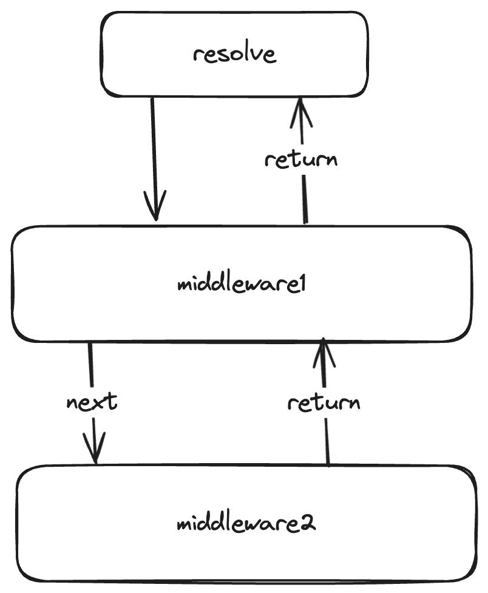

# Middleware

Middleware is designed to perform intermediary operations, such as intercepting resolves, adding logs, transforming results, and more.

## Illustration

## Example: Transform

<iframe src="https://stackblitz.com/edit/typescript-arith6?devToolsHeight=33&embed=1&file=index.ts&hideNavigation=1"
     style="width:100%; height: 700px; border:0; border-radius: 4px; overflow:hidden;"
     title="Middleware Transform Example"
     allow="accelerometer; ambient-light-sensor; camera; encrypted-media; geolocation; gyroscope; hid; microphone; midi; payment; usb; vr; xr-spatial-tracking"
     sandbox="allow-forms allow-modals allow-popups allow-presentation allow-same-origin allow-scripts"
   ></iframe>
