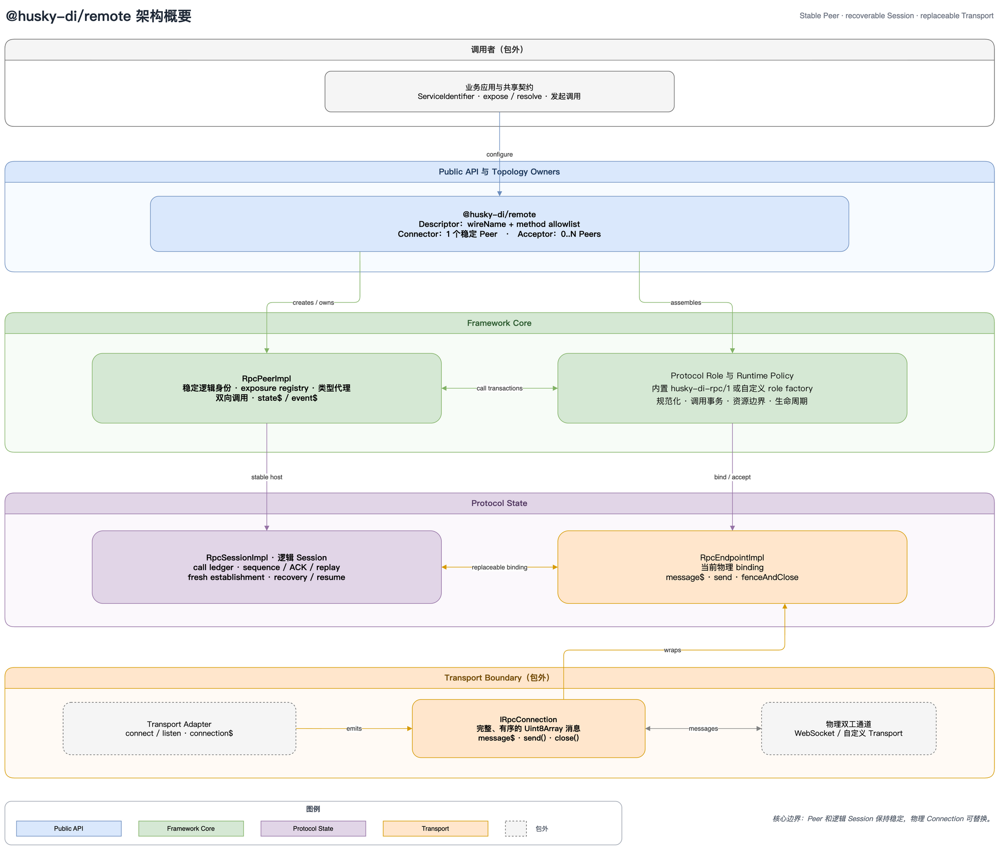
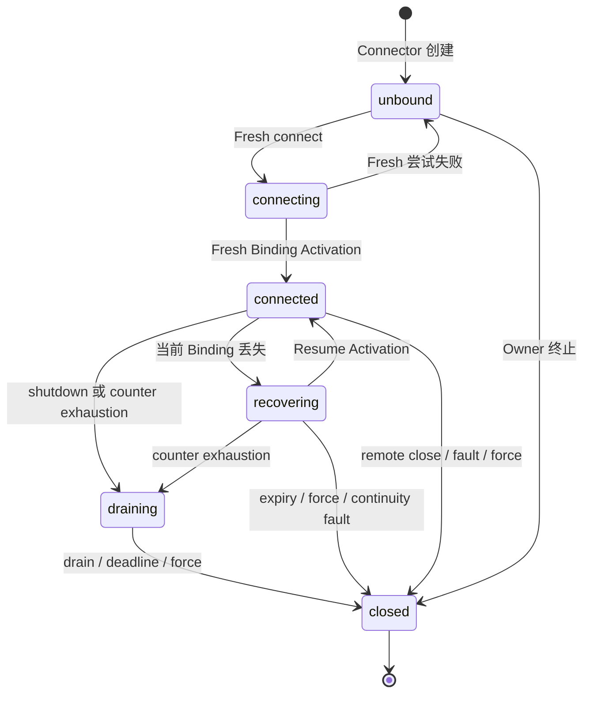
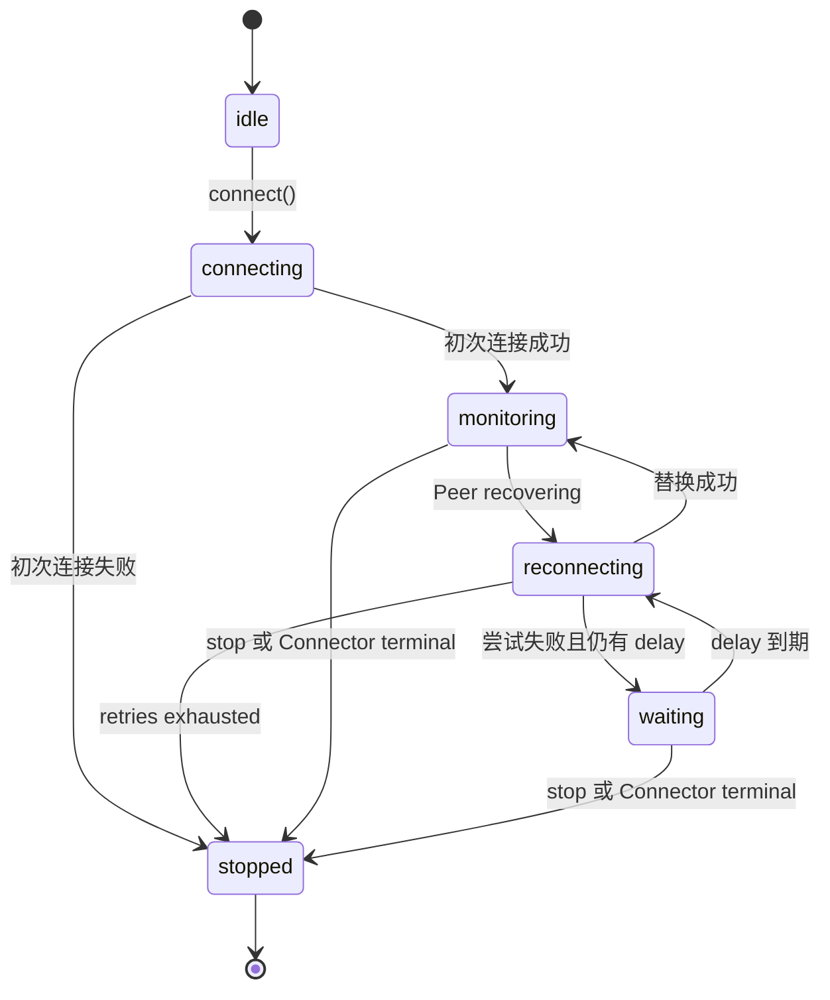
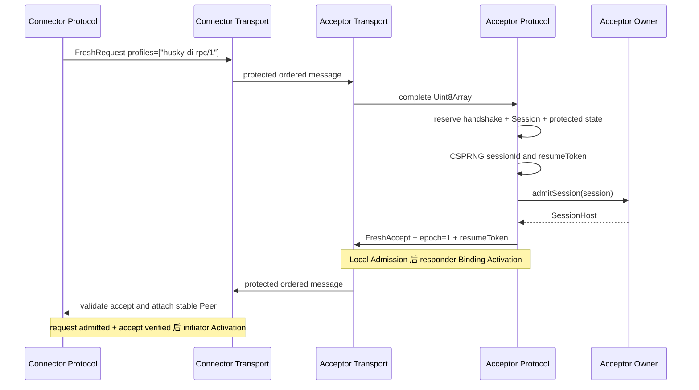

# `@husky-di/remote` 完整使用与原理指南

> 本文面向具备 TypeScript、Promise 和依赖注入基础的开发者，目标是帮助读者从零使用
> `@husky-di/remote`，并理解它在调用、恢复、资源、调度、安全和终止方面的完整工作方式。
>
> 本文是解释性与操作性文档，不替代规范。发生冲突时，以
> [`SPECIFICATION.md`](SPECIFICATION.md) 为唯一规范性依据。本文依据当前仓库快照编写：
> 包清单版本仍为 `0.0.0`，规范描述的首个稳定目标版本为 `1.0.0`，状态为
> “Normative proposal”。

## 目录

1. [先给结论](#1-先给结论)
2. [适用场景与非目标](#2-适用场景与非目标)
3. [安装、运行环境与入口](#3-安装运行环境与入口)
4. [架构与核心词汇](#4-架构与核心词汇)
5. [从零完成一次 RPC](#5-从零完成一次-rpc)
6. [Remote Service Descriptor 详解](#6-remote-service-descriptor-详解)
7. [Connector、Acceptor、Peer 与 Facade](#7-connectoracceptorpeer-与-facade)
8. [一次调用的完整生命周期](#8-一次调用的完整生命周期)
9. [取消语义](#9-取消语义)
10. [Application Value 数据模型](#10-application-value-数据模型)
11. [状态、Observable 与事件](#11-状态observable-与事件)
12. [启动、监听与 Transport Adapter](#12-启动监听与-transport-adapter)
13. [内置 `husky-di-rpc/1` Protocol](#13-内置-husky-di-rpc1-protocol)
14. [Session 建立、Recovery 与重放](#14-session-建立recovery-与重放)
15. [Connector Reconnection 监督器](#15-connector-reconnection-监督器)
16. [资源预算、并发和公平调度](#16-资源预算并发和公平调度)
17. [错误语义](#17-错误语义)
18. [`shutdown()`、`close()` 与清理](#18-shutdownclose-与清理)
19. [安全模型](#19-安全模型)
20. [实现自定义 Protocol](#20-实现自定义-protocol)
21. [实现自定义 Transport Adapter](#21-实现自定义-transport-adapter)
22. [完整公共 API 参考](#22-完整公共-api-参考)
23. [源码实现地图](#23-源码实现地图)
24. [测试、Conformance 与本地开发](#24-测试conformance-与本地开发)
25. [实践建议与常见问题](#25-实践建议与常见问题)
26. [术语表与延伸阅读](#26-术语表与延伸阅读)

## 1. 先给结论

`@husky-di/remote` 是一个 TypeScript 优先、Transport 无关、双向、Unary 的 RPC 框架。
它让两端共享同一个服务类型和 Remote Service Descriptor：

- 提供方通过 `peer.expose()` 或 `acceptor.expose()` 暴露实现；
- 调用方通过 `peer.resolve()` 获得全异步、强类型的远程 Facade；
- 内置 Protocol 把一次逻辑调用映射为带顺序号、累计 ACK、去重账本和终态重放的消息；
- Logical Session 可以跨 Physical Connection 的丢失与替换继续存在；
- Transport 只负责连接、完整消息、背压与关闭，不理解 RPC 语义；
- Connector 和 Acceptor 负责拓扑、资源预算、事件、生命周期和清理。

最重要的设计不是“网络代理”，而是下面这条边界：

> **Peer 与 Logical Session 保持稳定，Physical Connection 可以被替换。**

这使恢复期间已经解析的 Facade、暴露的实现、待处理调用、调用身份和重放证据可以继续使用，
同时又不会把“连接重试”错误描述成“业务一定没有执行”。

### 1.1 能保证什么

| 能力 | 精确含义 |
| --- | --- |
| 类型推导 | 从普通 TypeScript 服务接口推导远端方法；本地返回值在 Facade 上变成 `Promise<Awaited<T>>`。 |
| 显式暴露面 | 只有 Descriptor `methods` 白名单里的方法可以调用。 |
| 双向调用 | 同一个连接上的两端都可以 `expose` 和 `resolve`。 |
| Session 内防重复执行 | 只要同一个 Session Incarnation、调用账本、顺序连续性和当前 Binding 仍可证明，重放不会再次 dispatch 同一个 Logical Call。 |
| 恢复 | 物理连接丢失后，可以用同一个 `resumeToken`、更高的 `resumeAttempt` 和游标恢复。 |
| 有界运行 | Pending、Handler、Replay、Ingress、Session、Connection 和保留字节都有上限。 |
| 有界终止 | 正常关闭最多经历一个 drain deadline 和一个 cleanup deadline；强制关闭只经历 cleanup deadline。 |
| 诚实错误 | 明确区分“确定未执行”的 `unavailable` 和“可能执行但结果证据丢失”的 `outcome-unknown`。 |

### 1.2 不能保证什么

| 非保证 | 原因 |
| --- | --- |
| 跨进程重启恢复 | v1 Session 只保存在内存中；进程重启即结束 Incarnation。 |
| 外部副作用 exactly-once | RPC 账本无法替代数据库事务、幂等键或业务去重。 |
| 取消即回滚 | `AbortSignal` 是协作式取消；已经发生的远端副作用不会自动撤销。 |
| Transport 安全 | 核心接口看不到 TLS、证书、Origin 或身份策略；这些由部署和 Adapter 负责。 |
| 流式调用 | 当前只支持 Unary request/response，不支持 Observable、AsyncIterable 或 Streaming RPC。 |
| 服务发现 | `wireName` 必须由双方共享并精确一致。 |
| 自动 DI 容器桥接 | Descriptor 保留本地 `ServiceIdentifier`，但 v1 不自动把远端服务注册进 Container。 |

## 2. 适用场景与非目标

### 2.1 适合使用

- Browser 与 Node 进程之间的类型化 request/response；
- 主进程与 Renderer、Worker、插件宿主等拥有长寿命逻辑会话的进程；
- 连接可能短暂中断，但希望保留 Peer 身份和在途调用证据；
- 服务需要双向回调；
- Acceptor 同时管理多个独立 Peer；
- 希望替换 WebSocket 为自定义消息 Transport；
- 希望保留 Framework 调用模型，但替换整个语义 Protocol。

### 2.2 不适合直接使用

- 大文件、媒体流或无限数据流；
- 必须跨服务重启继续同一个在途调用；
- 必须提供全局广播语义、订阅语义或 Framework 定义的多 Peer 聚合结果；
- 业务数据不能表达为有限 JSON 树；
- 需要由 RPC 层完成用户认证、授权、租户隔离、限流或审计存储；
- 需要把网络超时自动重试成新的业务调用并宣称不会重复副作用。

### 2.3 v1 明确排除的能力

- Notifications；
- Streaming；
- 自动 Container 集成；
- 业务认证、授权与速率限制；
- 改写调用的中间件；
- 跨进程持久化 Recovery；
- 外部副作用的 exactly-once；
- Framework 内置的 Acceptor 广播 Facade；
- 默认 Transcript、日志缓冲区、Telemetry Exporter 或 Trace 传播。

## 3. 安装、运行环境与入口

### 3.1 Node 环境

当前包声明 Node.js `>=23.6`。运行时依赖只有：

- `@husky-di/core`；
- `rxjs`；
- `zod`。

`@husky-di/remote` 本身不提供 WebSocket。常见 WebSocket 部署还需要
`@husky-di/remote-websocket`：

```bash
pnpm add @husky-di/core @husky-di/remote @husky-di/remote-websocket rxjs ws
```

Browser-only Connector 不需要 `ws`。Node Connector 和 Acceptor 从
`@husky-di/remote-websocket/node` 导入，并要求 `ws`。

### 3.2 四个公共入口

| 入口 | 面向对象 | 用途 |
| --- | --- | --- |
| `@husky-di/remote` | 应用开发者 | Descriptor、Connector、Acceptor、Reconnection、状态、事件、错误以及调用方必要的结构类型。 |
| `@husky-di/remote/protocol` | Protocol 实现者 | 完整语义 SPI、Host Port、Session 事务和内置 Protocol role 工厂。 |
| `@husky-di/remote/transport` | Adapter 实现者 | `IRpcConnection`、Connector Adapter、Acceptor Adapter。 |
| `@husky-di/remote/conformance` | Provider 与 Adapter 作者 | 独立于 Vitest/Jest 的共享一致性测试运行器。 |

应用通常只需要根入口和一个 Transport 包。不要通过源码深路径导入私有类。

### 3.3 模块格式与打包

包声明 `type: "module"`，同时发布：

- ESM `import`；
- CJS `require`；
- TypeScript `.d.ts`。

包声明 `sideEffects: false`，可被正常 Tree Shaking。根入口与子入口重复导出的符号保持同一个
声明和运行时身份，例如两个入口的 `createRpcProtocolConnector` 和 `createRpcProtocolAcceptor`
分别是同一个函数值。

## 4. 架构与核心词汇

### 4.1 总体架构



图 1 自上而下分为四个边界：

1. 调用者拥有业务类型、Descriptor、暴露实现和调用策略；
2. Public API 与 Topology Owner 提供稳定 Peer、状态、事件和生命周期；
3. Framework Core 管理调用事务、资源、Handler 和公共投影；
4. Protocol 管理 Session、顺序、ACK、Replay、Binding 和 Recovery；
5. Transport Boundary 只传输完整的 `Uint8Array` 消息。

架构图中的虚线框代表包外组件。Transport Adapter 和真实网络通道不属于
`@husky-di/remote` 核心实现。

### 4.2 五个最常用概念

| 概念 | 责任 |
| --- | --- |
| Remote Service Descriptor | 把本地服务类型、线上 `wireName` 和非空方法白名单绑定成一个不透明值。 |
| Peer | 一个稳定逻辑对端；可以暴露本地实现、解析远程 Facade，并公开 Session 状态。 |
| Topology Owner | `IRpcConnector` 或 `IRpcAcceptor`；拥有 Peer、Protocol role、Transport 资源、预算和终止。 |
| Transport Adapter | 建立或接受 Physical Connection；不理解调用、ACK、Session 或 Recovery Token。 |
| Connector Reconnection | 可选的有限重试监督器；只编排 Connector 的替换连接尝试。 |

### 4.3 理解原理必须掌握的词

| 词汇 | 含义 |
| --- | --- |
| Protocol Role | 一个 role factory 为单个 Owner 创建的 fresh `IRpcProtocolConnector` 或 `IRpcProtocolAcceptor`。 |
| Physical Connection | 一个有限寿命、有序、全双工、完整消息通道。 |
| Logical Session | 可以比 Physical Connection 活得更久的 Protocol 状态；一个稳定 Peer 由它支撑。 |
| Session Incarnation | 一份 Logical Session 保留状态的完整生命周期；终止或丢失后不能重建成“同一个”会话。 |
| Binding Epoch | Acceptor 分配的单调递增连接代次；用于把旧连接回调彻底 fencing。 |
| Binding Linearization | 原子选择“当前连接”，提高 Epoch，并先废弃旧 Binding。 |
| Binding Activation | Linearization 后，等握手响应达到 Local Admission，再允许传输 Active RPC。 |
| Pending Invocation | 已通过本地前置校验、但还没有 `callId` 和 `seq` 的调用。 |
| Logical Call | 已通过 Outgoing Admission，拥有稳定 Session 内身份的调用。 |
| Remote Request Admission | 接收方原子保留调用证据并允许排队执行 Handler 的时刻。 |
| Local Admission | `IRpcConnection.send()` fulfilled；仅表示 Transport 已在本地有限路径中接纳消息。 |
| Message Receipt ACK | 累计确认某个 `seq` 已有持久、幂等的处置；不是 Handler 完成证明。 |
| Definite Non-Execution | 能证明远端 Handler 没有执行、以后也不会执行。 |
| Outcome Unknown | Handler 可能执行过，但权威终态证据已经不可证明。 |

### 4.4 三层关闭不是一件事

| API | 所属层 | 含义 |
| --- | --- | --- |
| Owner `close(): Promise<void>` | Framework | 终止整个 Connector/Acceptor，等待受控清理。 |
| Protocol role `close(): void` | Protocol SPI | 同步 fencing、结算语义状态，不等待物理清理。 |
| Connection `close(): Promise<void>` | Transport | 直接关闭一个物理资源，不等待 RPC Handler、ACK 或业务工作。 |

不能把三者实现成别名。

## 5. 从零完成一次 RPC

下面的例子使用 Node WebSocket：Acceptor 暴露计算器，Connector 调用它。

### 5.1 定义双方共享的服务契约

```typescript
// calculator.contract.ts
import { createServiceIdentifier } from "@husky-di/core";
import { createRemoteServiceDescriptor } from "@husky-di/remote";

export interface Calculator {
  add(left: number, right: number): number;
}

const ICalculator = createServiceIdentifier<Calculator>("ICalculator");

export const REMOTE_CALCULATOR = createRemoteServiceDescriptor(ICalculator, {
  wireName: "example.calculator.v1",
  methods: {
    add: true,
  },
});
```

关键点：

- `Calculator` 是普通本地类型；
- `ICalculator` 只用于本地类型与本地 exposure lookup；
- `example.calculator.v1` 才是线上服务身份；
- `methods` 是显式白名单；
- 本地 `add(): number` 会映射为远端 `add(): Promise<number>`。

### 5.2 在 Acceptor 暴露服务

```typescript
// server.ts
import { createRpcAcceptor } from "@husky-di/remote";
import { createNodeWebSocketAcceptorAdapter } from "@husky-di/remote-websocket/node";

import { REMOTE_CALCULATOR } from "./calculator.contract";

const acceptor = createRpcAcceptor();

const stopExposing = acceptor.expose(REMOTE_CALCULATOR, {
  add(left, right) {
    return left + right;
  },
});

await acceptor.listen(
  createNodeWebSocketAcceptorAdapter({
    port: 8080,
  }),
);

await new Promise<void>((resolve) => process.once("SIGINT", resolve));

stopExposing();
await acceptor.shutdown();
```

`acceptor.listen()` fulfilled 表示 listener 已 ready，不表示 listener 生命周期结束。Acceptor 可以在
同一个 listener 下接纳多个 Physical Connection 和多个 Peer。

`acceptor.expose()` 是 owner-scoped exposure：

- 原子应用于所有当前 Peer；
- 自动应用于未来 Peer；
- 清理函数会阻止后续新调用；
- 已经 Remote Request Admission 的调用继续使用当时捕获的 Handler。

### 5.3 在 Connector 解析并调用

```typescript
// client.ts
import {
  createRpcConnector,
  createRpcConnectorReconnection,
} from "@husky-di/remote";
import { createNodeWebSocketConnectorAdapter } from "@husky-di/remote-websocket/node";

import { REMOTE_CALCULATOR } from "./calculator.contract";

const connector = createRpcConnector();
const calculator = connector.peer.resolve(REMOTE_CALCULATOR);

const reconnection = createRpcConnectorReconnection({
  connector,
  adapterFactory: () =>
    createNodeWebSocketConnectorAdapter({
      url: "ws://127.0.0.1:8080",
    }),
});

try {
  await reconnection.connect();
  console.log(await calculator.add(20, 22)); // 42
} finally {
  await reconnection.stop();
  await connector.shutdown();
}
```

可以在连接建立之前 `resolve()`。Connector 的 `peer` 和 `calculator` Facade 在 Recovery 前后保持
稳定，无需重新解析。

示例为了本地运行使用 `ws:`。生产环境必须使用满足第 19 节条件的 `wss:` 或其他受保护
Transport。

### 5.4 Browser Connector

Browser 使用 browser-safe 根入口：

```typescript
import {
  createRpcConnector,
  createRpcConnectorReconnection,
} from "@husky-di/remote";
import { createWebSocketConnectorAdapter } from "@husky-di/remote-websocket";

const connector = createRpcConnector();
const reconnection = createRpcConnectorReconnection({
  connector,
  adapterFactory: () =>
    createWebSocketConnectorAdapter({
      url: new URL("/rpc", window.location.href),
    }),
});

await reconnection.connect();
```

每次尝试都必须创建一个新的、cold、single-use Adapter，不能重复使用已经启动过的 Adapter。

### 5.5 双向调用

连接两端都有 Peer，所以 Connector 也可以暴露服务：

```typescript
const stopClientEvents = connector.peer.expose(REMOTE_CLIENT_EVENTS, {
  changed(message) {
    console.log(message);
  },
});
```

Acceptor 在某个 Peer 上反向解析：

```typescript
const clientEvents = peer.resolve(REMOTE_CLIENT_EVENTS);
await clientEvents.changed("session-opened");
```

这不是第二条连接，也不是特殊“callback channel”；它使用同一个 Session 的反方向 Call Ordinal、
sequence、ACK 和 ledger。

### 5.6 多 Peer 组合

Framework 不定义广播语义。应用从 Acceptor 快照显式组合：

```typescript
const peers = acceptor.peers;
const calls = peers.map((peer) =>
  peer.resolve(REMOTE_CLIENT_EVENTS).changed("maintenance-scheduled"),
);
const deliveries = await Promise.allSettled(calls);

for (const [index, delivery] of deliveries.entries()) {
  if (delivery.status === "rejected") {
    console.warn(peers[index], delivery.reason);
  }
}
```

应用自己决定：

- 哪些 Peer 有资格；
- 并发上限；
- 顺序；
- 取消；
- 结果与 Peer 的关联；
- fail-fast 还是 wait-all；
- 是否重试。

## 6. Remote Service Descriptor 详解

### 6.1 Descriptor 的三部分

`createRemoteServiceDescriptor(serviceIdentifier, options)` 绑定：

1. 本地 `ServiceIdentifier<T>`；
2. 精确 `wireName`；
3. 非空 `methods` allowlist。

Descriptor 本身是：

- 冻结对象；
- null prototype；
- 不透明；
- 通过包实例内部 `WeakMap` 关联元数据；
- 在服务类型和定义类型上保持不变性。

伪造普通对象、来自另一个重复安装的包实例的对象，或序列化再恢复的对象，都不是有效 Descriptor。

### 6.2 `ServiceIdentifier` 与 `wireName` 的区别

`ServiceIdentifier`：

- 为本地类型和本地暴露查找提供身份；
- 不在 wire 上传输；
- 它的 display name、metadata、对象身份和模块身份都不参与路由。

`wireName`：

- 是唯一线上服务路由键；
- 非空；
- 最多 256 UTF-8 bytes；
- 区分大小写；
- 不做 Unicode normalization；
- 双方必须逐字符精确一致。

推荐显式版本化，例如 `com.example.billing.v1`，不要依赖 TypeScript 符号名或压缩后的类名。

### 6.3 方法选择规则

`methods` 只能选择 `T` 上的 string-named function：

```typescript
methods: {
  getUser: true,
  generateReport: { cancelable: true },
}
```

静态类型会排除或拒绝：

- 非函数属性；
- 名字 `then`；
- `any` 参数；
- `any` 结果；
- `Observable` 结果；
- `AsyncIterable` 结果；
- 非法位置的 `AbortSignal`；
- cancelable 方法中的可变参数前缀；
- 空 allowlist。

普通非 cancelable 方法可以有 optional 或 rest 参数。v1 不在运行时反射校验业务参数个数。

Generic 和 overloaded call signature 不受支持：类型系统不承诺可靠拒绝，也不承诺保持每个 overload
之间的关系。应先把它们改成明确的非泛型 Unary 方法。

### 6.4 `then` 为什么被保留

所有远程 Facade 都故意满足 `facade.then === undefined`。这样：

```typescript
await facade;
Promise.resolve(facade);
return facade; // 从 async 函数返回
```

都不会触发 Promise thenable assimilation，也不会意外发起 RPC。因此：

- Descriptor 不能选择 `then`；
- runtime 会拒绝 `then`；
- wire 收到 `method: "then"` 会作为 Protocol violation 处理。

### 6.5 Runtime 对 Descriptor 的二次校验

即使 TypeScript 已经检查，runtime 仍会：

- 要求 `methods` 是 plain record；
- 要求至少一个 own key；
- 拒绝 symbol key；
- 要求每个方法名满足 wire identifier 限制；
- 拒绝 `then`；
- 要求每个定义是 enumerable data property；
- 拒绝 getter/setter；
- 只接受字面值 `true`，或精确形状 `{ cancelable: true }`；
- 拒绝 cancelable 对象的额外字段。

工厂会复制并冻结 allowlist，因此之后修改原始 `options.methods` 不会改变 Descriptor。

### 6.6 Exposure 的原子安装

`expose(descriptor, implementation)` 在提交前验证整个暴露面：

- implementation 必须是 object 或 function；
- 每个选中成员必须能沿 prototype chain 找到；
- prototype chain 不能形成 cycle；
- 成员必须是 data property 中的 function；
- getter 不会被调用；
- 所有 Handler 引用和 implementation 对象会被快照；
- wireName 不能与有效命名空间中的现有 exposure 冲突。

任何一个方法无效都会同步抛出 `TypeError`，且不会部分安装。

安装后替换 `implementation.method` 不会改变已捕获的 Handler。调用时使用原 implementation 作为
`this`。

### 6.7 Acceptor 命名空间

一个 Acceptor Peer 的有效 exposure namespace 是：

```text
peer-local registry ∪ acceptor owner registry
```

同一个 `wireName` 不能同时出现在两边：

- `acceptor.expose()` 会预检 owner registry 和所有当前 Peer local registry；
- `peer.expose()` 会预检自己的 local registry 和 owner registry；
- 新 Peer 直接读取 owner registry，不复制 owner exposure。

### 6.8 Exposure cleanup

`expose()` 返回的 cleanup：

- 同步；
- 幂等；
- 不抛错；
- 只删除仍由这一 exposure 占据的 entry；
- 不影响已经 Admission 的调用，因为它们已经捕获 route。

Peer 或 Owner 进入 draining/closing/closed 后，新的 `expose()` 同步抛
`RpcException(unavailable)`。

## 7. Connector、Acceptor、Peer 与 Facade

### 7.1 工厂是 cold 的

`createRpcConnector()`、`createRpcAcceptor()` 和
`createRpcConnectorReconnection()` 都不会启动网络 I/O。

真正转移资源所有权的是：

- `connector.connect({ adapter, signal })`；
- `reconnection.connect()`；
- `acceptor.listen(adapter)`。

订阅 `state$`、`peers$` 或 `event$` 也不会启动、停止或拥有任何资源。

### 7.2 Connector

一个 Connector：

- 从创建时就有且只有一个稳定 `peer`；
- Peer 初始状态是 `unbound`；
- 每次只能有一个 connection attempt；
- Fresh 成功后安装一份 Logical Session；
- Recovery 成功后继续使用同一 Peer 和同一 Session；
- Peer 终止会让 Connector topology 也进入终止流程。

Connector Owner 自身只有：

```text
active -> draining -> closing -> closed
```

连接是否存在由 `connector.peer.state` 表达，不要把 `connector.state === active` 误解成“已连接”。

### 7.3 Acceptor

一个 Acceptor：

- 拥有一个可重启的 listener 投影；
- 可以有 0..N 个稳定 Peer；
- Fresh Session admission 才创建 Peer；
- Recovery 不创建新 Peer；
- 一个 Peer 的 Protocol/Resource fault 不影响健康 sibling；
- listener 停止不关闭现有 Peer，也不关闭 Acceptor；
- 只有真正 shared owner fault 才终止整个 topology。

`acceptor.peers` 是当前冻结快照。`peers$` replay 最新 membership。

### 7.4 Peer

Peer 的公共职责很小：

```typescript
interface IRpcPeer {
  readonly state: RpcPeerState;
  readonly state$: Observable<RpcPeerState>;
  expose(...): Cleanup;
  resolve(...): RemoteService;
}
```

Peer 不公开：

- Session ID；
- resumeToken；
- Binding Epoch；
- sequence、ACK、cursor；
- internal queues；
- capacity getter；
- 手动 pause/resume；
- runtime replacement setter。

### 7.5 `resolve()` 返回什么

`resolve()` 同步返回一个：

- 冻结；
- null prototype；
- 只有 allowlist 方法闭包；
- `then === undefined`；
- 不依赖调用时 `this`；
- 不捕获当前 Physical Connection；
- 不捕获当前 membership；
- 能跨 Recovery 使用的 Facade。

重复 `resolve()` 不保证对象相等。即使 Peer 已关闭仍可以 `resolve()`，但真正调用会异步拒绝
`unavailable`。

### 7.6 Recovery 期间可以调用吗

可以。公共调用 gate 允许 Peer 为：

- `connected`；
- `recovering`。

Recovery 期间的新调用先成为有界 Pending Invocation，等待替换 Binding。它尚未 Outgoing Admission
时没有 `callId` 和 `seq`，因此如果 Session 在此期间终止，可以明确映射为 `unavailable`。

Peer 为 `unbound`、`connecting`、`draining` 或 `closed` 时，新调用拒绝 `unavailable`。

## 8. 一次调用的完整生命周期

### 8.1 可交互图例

[打开可交互的完整调用链路图](RPC_CALL_SEQUENCE.html)


图 2 的线型图例：

- 绿色实线：主要请求或 Admission 路径；
- 灰色虚线：返回路径；
- 红色虚线：跨 Transport 的受保护消息；
- 紫色虚线：异步累计 ACK；
- 灰色实线：Framework 内部默认消息。

### 8.2 第 1 步：Facade 调用和 control slot

Facade closure 首先拆分 cancelable 方法的最后一个控制参数：

1. 非 cancelable 方法：所有实参都是 Application Arguments；
2. cancelable 方法：必须至少传一个实参；
3. 最后一个实参为 `undefined`：本次不安装取消；
4. 否则必须是平台 `AbortSignal`；
5. 已 aborted 的 Signal 立即异步拒绝 `RpcException(canceled)`。

此时还没有创建 Pending、事件、`callId` 或 `seq`。

### 8.3 第 2 步：严格前置校验顺序

前置校验顺序固定为：

```text
control shape
-> initially aborted
-> Owner / Peer availability
-> Application Value snapshot
-> Protocol / Session capacity
```

顺序有语义价值：

- 非法 Signal 或 Value 得到 `TypeError`；
- 初始取消得到 `canceled`；
- 状态或容量不足得到 `unavailable`；
- 容量检查之前失败，不会留下 Pending、调用身份、事件或 retained payload。

### 8.4 第 3 步：Pending Invocation

Session `reserveInvocation()`：

- 检查未关闭、未 draining；
- 检查每 Session Pending 数量；
- 检查 Pending byte subcap；
- 同时预留 Session 和 Owner retained-byte ledger；
- 返回 reserve/commit/release 单赢家事务。

Framework commit 后：

- 创建本地 `observationId`；
- 创建 public Promise；
- 发送 `call-started`；
- 形成 Pending；
- 仍然没有 `callId` 或 `seq`。

`start()` 才让 Pending 进入 Protocol scheduler。

### 8.5 第 4 步：Outgoing Admission

当有 active current Binding、send slot idle、replay barrier 已满足调度条件时，Session 原子地：

1. 分配 direction-local `callId`；
2. 分配连续 `seq`；
3. 构造不可变 `Call` semantic message；
4. 为最大 ACK 位宽预验证完整 envelope；
5. 把 Pending retained charge 转移到 Replay entry；
6. 把调用写入 outgoing call ledger；
7. 第一次调用 `IRpcConnection.send()`。

这一步是不跨 `await` 的 Admission 边界。完成后：

- 该调用成为 Logical Call；
- 取消不能再证明“远端一定不会执行”；
- Connection 丢失时必须依赖 ACK、Replay 和终态证据决定结果。

### 8.6 第 5 步：Transport Local Admission

`send()` fulfilled 只表示本地有限路径接纳了消息。它不表示：

- socket flush；
- 对端收到；
- 对端 decode；
- ACK；
- Remote Request Admission；
- Handler 开始；
- Handler 完成。

一个 Connection 上最多只能有一个 unsettled `send()`。

### 8.7 第 6 步：远端验证和 Remote Request Admission

远端按固定顺序处理 Call：

1. endpoint/epoch gate；
2. raw bytes、UTF-8、JSON、重复字段和固定上限；
3. record schema 与 phase；
4. 当前 Binding authority；
5. seq 连续性与 Call Ordinal；
6. **普通容量检查，且此时不做 route lookup**；
7. 精确 service/method lookup；
8. 持久处置；
9. receipt、activity、event 和 transient release。

容量不足但 protected reserve 完整时：

- 记录受保护 `unavailable` terminal；
- 推进 receipt；
- 不保留 args；
- 不查询 route；
- 不创建 incoming event；
- 保证 Handler 没有执行。

容量足够时：

- 已知 route：捕获 implementation、Handler 和 cancelable flag，创建 in-progress ledger；
- 未知 service/method：创建安全的语义终态与成对事件，不 dispatch Handler。

### 8.8 第 7 步：Handler 调度

Handler 不会在 Transport ingress callback 内执行。Framework 将 job 放入 owner-wide scheduler：

- 单个 Session 内 FIFO；
- ready Session 之间 round-robin；
- 同时获得每 Session permit 和 Owner permit；
- 默认每 Session 16 个 running Handler；
- 默认 Owner 总计 64 个。

排队期间调用被取消或 Session 强制终止：

- job 立即 unlink；
- Handler 不会启动；
- payload 与 closure 及时释放。

Handler 已运行：

- 即使取消已经赢得公共结果，Handler 仍占用 permit 直到真实 settle；
- late result 被消费；
- 不能改变 first-terminal-wins 结果；
- Framework 不设置正常 Handler 执行超时。

### 8.9 第 8 步：结果归一化和固定终态

Handler：

- 同步返回；
- 返回 Promise；
- 抛错；
- Promise reject；
- 返回无效 Application Value；

都会被统一观察。

成功结果必须先归一化成 detached immutable Application Value。`undefined` 表示 wire 上没有
`value`，即 `void`。其他无效结果、过大结果、无法编码结果或普通 terminal payload 容量不足，
统一降级为安全 `handler-failed`。

Terminal entry 在排队发送前已经不可变。对应 Result/Error 的 Replay entry 保留到对端 ACK。

### 8.10 第 9 步：调用方 first-terminal-wins

以下竞争者共享一个单赢家终态：

- caller cancellation；
- remote result/error；
- Session loss；
- Owner force；
- Handler settlement；
- Protocol terminal。

第一个赢家：

- 完成 public Promise；
- 发出唯一 `call-finished`；
- 后续消息只能做 ACK/GC；
- 不能改写 Promise 或事件。

### 8.11 三种身份不要混淆

| 身份 | 作用域 | 是否上 wire | 用途 |
| --- | --- | --- | --- |
| `observationId` | 单端、本地、一个 started/finished pair | 否 | Telemetry 关联。 |
| `callId` | Session Incarnation + originating direction | 是 | Logical Call 身份和去重。 |
| `seq` | Session 内单个发送方向 | 是 | 消息顺序、ACK 和 Replay。 |

`callId` 与 `seq` 都从 1 连续增长，但它们是独立计数器，不能互相替代。

### 8.12 At-most-once 的精确边界

框架只在以下证据都存在时保证一个 Logical Call 不重复 dispatch：

- 同一个 Session Incarnation；
- 同一个 direction-local `callId`；
- 连续 sequence；
- retained replay / dedupe / terminal ledger；
- 单一 current Binding authority。

如果这些证据丢失，框架不会偷偷创建新 `callId` 重试，也不会宣称 exactly-once。

## 9. 取消语义

### 9.1 定义 cancelable 方法

本地实现签名必须有且只有一个精确、必填、最后位置的 `AbortSignal`：

```typescript
interface Reports {
  generate(reportId: string, signal: AbortSignal): Promise<string>;
}

const REMOTE_REPORTS = createRemoteServiceDescriptor(IReports, {
  wireName: "example.reports.v1",
  methods: {
    generate: { cancelable: true },
  },
});
```

远端 Facade 映射为：

```typescript
generate(
  reportId: string,
  signal: AbortSignal | undefined,
): Promise<string>;
```

`undefined` 是必传控制位置，表示本次不要求取消。

### 9.2 调用示例

```typescript
const controller = new AbortController();
const pending = reports.generate("weekly", controller.signal);

controller.abort();

try {
  await pending;
} catch (error) {
  if (
    !(error instanceof RpcException) ||
    error.code !== RpcExceptionCodeEnum.canceled
  ) {
    throw error;
  }
}

await reports.generate("monthly", undefined);
```

### 9.3 Signal 校验为何不用 `instanceof`

实现通过捕获的平台 intrinsic：

- `AbortSignal.prototype.aborted` getter；
- `EventTarget.prototype.addEventListener`；
- `EventTarget.prototype.removeEventListener`；

来支持 cross-realm Signal，并避免实例属性 shadow。安装监听后再次读取 `aborted`，关闭
check-to-register race。

### 9.4 Admission 前后取消不同

| 时点 | 行为 | 结果保证 |
| --- | --- | --- |
| 调用前已 aborted | 不创建 Pending | `canceled`，远端未执行。 |
| Pending、尚未 Admission | 移除 Pending 和 payload | `canceled`，远端未执行。 |
| Admission 后、远端未处理 | 本地结果可由取消获胜，并发送 `Cancel` | 协作式；不能仅凭取消证明未执行。 |
| Handler 排队 | 取消可移除 job | 如果取消先赢，Handler 不启动。 |
| Handler 运行 | abort 远端本地 Signal | Handler 必须自行响应；已有副作用不回滚。 |
| 已有终态 | 取消是 late no-op | 终态不被改写。 |

`Cancel` 是 sequenced semantic message，但不是 terminal，也不被当作 rollback 证明。

## 10. Application Value 数据模型

### 10.1 公共类型

```typescript
type RpcApplicationValue =
  | null
  | boolean
  | string
  | number
  | readonly RpcApplicationValue[]
  | IRpcApplicationRecord;

interface IRpcApplicationRecord {
  readonly [key: string]: RpcApplicationValue;
}
```

TypeScript 接口只能表达意图，不能静态证明某个任意业务对象在 runtime 满足 wire 约束。

### 10.2 接受和拒绝

| 接受 | 拒绝 |
| --- | --- |
| `null` | `undefined` |
| boolean | `bigint` |
| well-formed string | symbol、function |
| finite number，且不是 `-0` | `NaN`、`Infinity`、`-Infinity`、`-0` |
| dense data array | array hole、额外非 index 属性、accessor、symbol key |
| prototype 为 `Object.prototype` 或 `null` 的 record | `Date`、`Map`、`Set`、class instance、typed array |
| acyclic tree | ancestor cycle |

### 10.3 Record 检查

Normalizer：

- 只接受 plain prototype；
- 通过 `Reflect.ownKeys` 和 property descriptor 检查；
- 拒绝任何 own symbol key；
- 拒绝任何 own accessor，即使它不可枚举；
- 忽略 non-enumerable data property；
- 不调用 getter、coercion 或 `toJSON`；
- 输出 null-prototype、冻结的 detached record。

Proxy 不在契约内。Proxy trap 可能被触发并产生副作用，但 trap 返回值仍会被完整复核；trap 抛错会包装为
`TypeError`。

### 10.4 Array 检查

数组必须：

- `length` 是有效 data property；
- 长度是 non-negative safe integer；
- 只有 `length` 和 canonical in-range index；
- 每个 index 都是 enumerable data property；
- 没有 hole；
- 没有 accessor；
- 没有 symbol 或自定义属性。

输出是冻结的新数组。

### 10.5 固定上限

| 维度 | 上限 |
| --- | ---: |
| 完整 Transport message | 1,048,576 B |
| 单个 args/result/error-details compact-JSON weight | 1,000,000 B |
| 完整 wire tree depth | 67 |
| Application Value depth | 64 |
| 单个 decoded string | 524,288 B |
| Protocol identifier 或 object member name | 256 B |
| 单个 object members | 1,024 |
| 单个 array elements | 8,192 |
| 完整 decoded record nodes | 65,546 |
| 单个 Application Value nodes | 65,536 |

根节点 depth 为 1；每个 primitive、array、record 都算一个 node，member name 不算。

### 10.6 Cycle、共享引用与快照

- ancestor cycle 拒绝；
- 共享但无环的引用允许；
- 同一个共享对象在每个出现位置独立展开；
- 原对象后续修改不影响快照；
- Protocol 只能看到 Framework 创建的 opaque snapshot；
- 伪造 snapshot 会触发 Protocol fault。

### 10.7 Weight

Weight 使用：

- UTF-8 byte length；
- 无空白 compact JSON；
- ECMAScript `JSON.stringify` 的 number spelling；
- 最小必要 JSON string escaping；
- 对象 member 顺序不影响总 weight。

发送方在保留调用方数据、分配 Call Identity 或提交 Handler terminal 前验证 weight。

### 10.8 语义相等

Application Value equality：

- primitive 按值；
- number 按 binary64 值；
- array 保留顺序；
- record 比较 member-name set 和递归值；
- 忽略 record member 顺序、插入顺序、escape spelling、prototype 和对象身份；
- 不比较 encoded bytes。

## 11. 状态、Observable 与事件

### 11.1 Peer 状态机



状态 union：

| `status` | 额外字段 | 含义 |
| --- | --- | --- |
| `unbound` | 无 | Connector 尚无已验证 Session。 |
| `connecting` | 无 | Fresh 尝试中。 |
| `connected` | 无 | 有 active current Binding。 |
| `recovering` | 无 | Session 保留，但当前 Binding 不可用或正在替换。 |
| `draining` | `reason` | `graceful-shutdown` 或 `counter-exhaustion`。 |
| `closed` | `outcome`、`reason`，失败时有 `error` | Sticky terminal。 |

### 11.2 Connector Owner 状态

| 状态 | 含义 |
| --- | --- |
| `active` | 仍可根据 Peer 状态尝试连接、调用或暴露。 |
| `draining` | `shutdown()` 已同步选择 graceful cutoff。 |
| `closing` | 正在 force/finalize/cleanup。 |
| `closed` | 最终冻结结果。 |

Connector `closed` 可以投影其唯一 Peer 的 Session 终态，也可能因为 owned cleanup 失败而使用
`cleanup-failed`。

### 11.3 Acceptor listener 状态

当 Acceptor 为 `active` 时，`state.listener` 为：

| 状态 | 含义 |
| --- | --- |
| `idle` | 从未启动 listener。 |
| `starting` | Adapter 已接受，等待 ready。 |
| `listening` | ready，`listen()` 已可 fulfilled。 |
| `stopped(normal, completed)` | source 正常完成。 |
| `stopped(normal, resource-pressure)` | overflow 触发有界停止。 |
| `stopped(failed, error)` | Adapter source/startup 失败，保留同一个 trusted Error。 |

`stopped` 会保留到下一次成功接受 `listen()` 或 Owner 终止。

### 11.4 Reconnection 状态



它描述的是重连编排，不是权威 Session 状态。权威状态始终是
`reconnection.connector.peer.state`。

### 11.5 Replay-latest stream

以下 Observable 是 multicast、replay-latest：

- `peer.state$`；
- `connector.state$`；
- `acceptor.state$`；
- `acceptor.peers$`；
- `reconnection.state$`。

同步 getter 与最新 emitted object 是同一个冻结对象，直到下一次 committed mutation。
终止前先 emit 最终快照，再 complete；这些 stream 不 error。

### 11.6 `event$`

Owner 和 Reconnection `event$` 都是：

- hot；
- multicast；
- non-replaying；
- 不 error；
- terminal 后 complete。

必须在关心的操作之前订阅。

Owner `RpcEventTypeEnum`：

| 类型 | 关键字段 |
| --- | --- |
| `call-started` | `observationId`、`peer`、`direction`，已知 route 时带 service/method。 |
| `call-finished` | 上述关联字段、`durationMs`、`outcome`，reject 时带 safe code。 |
| `peer-opened` | `peer`。 |
| `peer-recovering` | `peer`。 |
| `peer-recovered` | `peer`。 |
| `peer-draining` | `peer`、reason。 |
| `peer-closed` | `peer`、outcome、reason。 |
| `owner-draining` | 无 payload。 |
| `owner-closing` | 无 payload。 |
| `topology-closed` | outcome、reason。 |

### 11.7 Call event 相关性

- outgoing `call-started` 在调用成为 Pending 时产生；
- known incoming start 在 Remote Request Admission 后、Handler dispatch 前产生；
- unknown service/method 产生相邻 started/finished pair；
- ordinary resource rejection 不产生事件；
- 每个 started 恰好有一个 finished；
- incoming `terminated` 没有 code；
- unknown-service 不暴露攻击者提交的 service/method；
- unknown-method 只暴露本地精确匹配的 service；
- `durationMs` 向下取整、非负，并在 `Number.MAX_SAFE_INTEGER` 饱和。

### 11.8 Event 不包含什么

事件不会包含：

- raw wire；
- args/result/details；
- thrown value、Error、stack、cause；
- Session ID、Call ID、sequence、ACK、cursor、epoch；
- resumeToken；
- Adapter URL/header/credential；
- 未匹配的攻击者字符串。

需要业务 payload 观测时，应在自己拥有的 caller/handler 边界记录。

### 11.9 原子 mutation 与通知顺序

Framework 先原子提交：

- call sink；
- owner state；
- membership；
- peer state；
- durable observation facts；

再按顺序 flush：

1. call terminal event；
2. owner state/membership/peer state；
3. peer lifecycle；
4. topology lifecycle；
5. public Promise settlement 最后发生。

这避免订阅者看到“Peer 已关闭，但调用 Promise/事件还没有终态”的半提交状态。

## 12. 启动、监听与 Transport Adapter

### 12.1 Transport seam

```typescript
interface IRpcConnection {
  readonly message$: Observable<Uint8Array>;
  send(message: Uint8Array): Promise<void>;
  close(): Promise<void>;
}

interface IRpcConnectorAdapter {
  readonly connection$: Observable<IRpcConnection>;
  connect(signal: AbortSignal): Promise<void>;
}

interface IRpcAcceptorAdapter {
  readonly connection$: Observable<IRpcConnection>;
  listen(signal: AbortSignal): Promise<void>;
}
```

### 12.2 Connection 契约

`message$`：

- hot、multicast、ordered、无 replay；
- late subscriber 仍能观察 terminal；
- 每个 `Uint8Array` 是一条完整 Protocol message；
- 同一次 notification 的所有 observer 获得同一个数组身份；
- emit 后 Adapter 不得修改、复用或 detach backing storage；
- 正常 terminal 用 complete；
- Transport/framing/admission failure 用同一个 trusted Error error。

`send()`：

- 每 Connection 最多一个 unsettled send；
- Adapter 可借用入参数组直到 settlement；
- fulfilled 表示 Local Admission；
- 暂时压力保持 Promise pending；
- 超过有限上限或 Transport 失败必须 reject 并 terminal Connection；
- 空闲路径必须支持至少 1 MiB 完整消息。

`close()`：

- 同步阻止新 send；
- reject unsettled send；
- 幂等并返回同一个 cleanup task；
- 等本地 terminal、`message$` terminal 和 Adapter cleanup；
- 不等待 RPC、ACK、remote confirmation 或 business work。

### 12.3 Connector Adapter handoff

Framework 先订阅 `connection$`，再调用 `adapter.connect(signal)`。

成功条件：

- 正好 emit 一个 Connection；
- 同步 `next` observer 全部返回是 ownership handoff barrier；
- barrier 后 Connection 才能 emit 第一条 message；
- source complete；
- `adapter.connect()` fulfilled。

pre-handoff abort：

- 清理 half-open 资源；
- source 无 value complete；
- startup reject `AbortError`。

handoff 后 signal abort 或 Connection 丢失不撤销已经完成的所有权转移。

### 12.4 Acceptor Adapter handoff

Framework 同样先订阅再 `listen(signal)`。Acceptor：

- 可以在 ready Promise fulfilled 前 emit Connection；
- 每个 notification return 都是该 Connection 的独立 handoff barrier；
- ready 前 abort：`listen()` reject `AbortError`，source complete；
- ready 后 abort：source 正常 complete；
- notification 内 abort 必须同步 gate 后续 emission；
- listener terminal 不关闭已转移 Connection。

### 12.5 `connector.connect()` gate

只在以下条件同时满足时接受：

- Owner `active`；
- stable Peer 为 `unbound` 或 `recovering`；
- 没有正在进行的 attempt；
- Connection ownership cap 未满。

Gate 在读取 options、Signal 和 Adapter 属性之前运行。无资格时异步拒绝
`RpcException(unavailable)`。

options 必须是只含：

```typescript
{
  adapter: IRpcConnectorAdapter;
  signal?: AbortSignal;
}
```

的 closed plain record。未知 key、accessor、非法 shape 得到 `TypeError`。

外部 Signal：

- 预先 aborted：不读取/启动 Adapter，reject `AbortError`；
- 后续 abort：只取消未 settle attempt；
- Fresh 失败返回 `unbound`；
- Resume 失败保持 `recovering`；
- Binding Activation 后 abort 无效；
- public `AbortError` 不暴露 `signal.reason`。

### 12.6 `acceptor.listen()` gate

只在：

- Owner `active`；
- listener 为 `idle` 或 `stopped`；
- 没有 listener attempt；
- 之前 listener cleanup 已完成；
- overflow Connection 已完成 Direct Close；

时接受。

`listen()` fulfilled 只表示 ready。之后 source completion/error 只更新 listener state，不反向改变已经
fulfilled 的 startup Promise。

### 12.7 Acceptor overflow

普通 Connection cap：

```text
maxSessions + 2 * maxHandshakes
```

Acceptor 额外保留一个不可借用 overflow-close slot。达到普通 cap 后的下一条 Connection：

1. 占用唯一 overflow slot；
2. 在 notification 内 abort listener，阻止后续接受；
3. ownership barrier 后第一个 continuation 中 Direct Close；
4. close settle 前不能 restart listener。

ready 前 overflow 使 `listen()` reject `AbortError`；ready 后 listener 正常停为
`resource-pressure`。

## 13. 内置 `husky-di-rpc/1` Protocol

### 13.1 Profile 是原子语义

省略 `options.protocolFactory` 时使用对应 Owner role 的内置 `husky-di-rpc/1` 实现。它一次性固定：

- UTF-8 JSON Codec；
- record grammar；
- Session bearer credential；
- Recovery；
- sequence；
- cumulative ACK；
- Replay；
- duplicate suppression；
- terminal retention；
- 调度与资源语义。

同一 profile 不做 Codec negotiation、弱化 feature flag 或扩展 registry。破坏兼容语义必须使用新
profile。

### 13.2 JSON 编码

每个 Transport message：

- 恰好一段 RFC 8259 UTF-8 JSON text；
- root 必须是 object；
- 不包含 `Content-Length` 等 stream framing；
- 最大 1 MiB。

Adapter 负责把 byte stream 或原生 frame 变成完整消息。

### 13.3 Raw parser 在普通 `JSON.parse` 前做什么

内置 bounded parser 拒绝：

- leading BOM；
- malformed UTF-8；
- unpaired surrogate；
- trailing second JSON value；
- non-whitespace trailing bytes；
- 解 escape 后重复 object member；
- 非法 JSON number；
- 非 finite number 或 `-0`；
- depth、node、member、array、string、message 上限。

这些 lexical facts 在普通 object materialization 后已经丢失，因此不能只依赖 Zod。

### 13.4 Zod grammar 的边界

bounded parser 之后，package-private Zod schema 是 decoded record shape 的唯一可执行来源。

- recognized top-level record 接受 bounded unknown tail 并忽略；
- nested `SemanticMessage` 也接受 bounded unknown tail；
- nested untagged `error` object 是 closed shape；
- `args`、`value`、`details` 内的所有字段都是 Application Data；
- `Close` 虽接受普通 unknown tail，但禁止 seq/ACK/token/reason/identity 等控制字段；
- Zod diagnostics 不跨 Codec seam，也不会进入 public error。

### 13.5 Bootstrap record

```text
FreshRequest = {
  kind: "fresh",
  profiles: [ProfileId, ...]
}

FreshAccept = {
  kind: "accept",
  profile: ProfileId,
  sessionId: Base64Url32,
  bindingEpoch: 1,
  resumeToken: Base64Url32
}

FreshReject = {
  kind: "reject",
  code: "unsupported-profile" | "admission-rejected",
  message?: string
}

ResumeRequest = {
  kind: "resume",
  profile: ProfileId,
  sessionId: Base64Url32,
  resumeToken: Base64Url32,
  receivedThrough: AckCursor,
  resumeAttempt: Sequence
}

ResumeAccept = {
  kind: "accept",
  profile: ProfileId,
  sessionId: Base64Url32,
  bindingEpoch: Sequence,
  receivedThrough: AckCursor
}

ResumeReject = {
  kind: "reject",
  code:
    | "resume-rejected"
    | "continuity-failure"
    | "session-terminated"
}
```

Fresh profile offer：

- 非空；
- 无重复；
- 保留 initiator preference；
- responder 选第一个精确支持的 profile；
- 无共同 profile 返回 `unsupported-profile`，不泄露支持列表。

### 13.6 Active record

```text
SequencedEnvelope = {
  kind: "message",
  seq: Sequence,
  ackThrough?: AckCursor,
  message: SemanticMessage
}

AckOnly = { kind: "ack", ackThrough: AckCursor }
Ping    = { kind: "ping" }
Pong    = { kind: "pong" }
Close   = { kind: "close" }
```

只有 `message` 有 `seq`。Ack/Ping/Pong/Close：

- connection-local；
- unsequenced；
- unreplayed；
- 不进入 call state；
- 不产生 public call event。

### 13.7 Semantic message

```text
Call = {
  kind: "call",
  callId: CanonicalCallOrdinal,
  service: NonEmptyIdentifier,
  method: NonEmptyIdentifier,
  args: ApplicationValue[]
}

Cancel = {
  kind: "cancel",
  callId: CanonicalCallOrdinal
}

Result = {
  kind: "result",
  callId: CanonicalCallOrdinal,
  value?: ApplicationValue
}

Error = {
  kind: "error",
  callId: CanonicalCallOrdinal,
  error: {
    code:
      | "canceled"
      | "unavailable"
      | "handler-failed"
      | "unknown-service"
      | "unknown-method",
    message: string,
    details?: ApplicationValue
  }
}
```

`CanonicalCallOrdinal` 是 1 到 `Number.MAX_SAFE_INTEGER` 的无符号十进制字符串：

- 不允许前导零；
- 两个方向独立；
- 不能复用或 wrap。

`Result` 缺失 `value` 表示 `void`；存在 `value: null` 仍是合法 null 值。

`outcome-unknown` 不上 wire，因为它是本地证据丢失映射。`protocol` 也不会伪装成 call error。
远端 `message/details` 只做安全验证，不进入 public `RpcException`。

### 13.8 phase

新 Connection 的第一条 initiator record 必须是 `fresh` 或 `resume`。Responder 第一条 outcome
必须是 `accept` 或 `reject`。

进入 active phase 的条件：

- initiator 的 bootstrap request 达到 Local Admission；
- initiator 验证对应 accept；
- responder 的 accept 达到 Local Admission；
- exact Binding 完成 Activation。

过早 active record、错误 phase 或未知 kind 都按第 14 节描述的 fault scope 处理。

## 14. Session 建立、Recovery 与重放

### 14.1 Fresh Session



Responder 为每个 Fresh Session 独立生成：

- 32-byte CSPRNG `sessionId`；
- 另一份独立的 32-byte CSPRNG `resumeToken`；
- 两者编码为 canonical unpadded Base64Url32，长度 43。

Session ID 最多尝试 8 个候选，并与 retained/provisional ID 集合检查。8 次碰撞被视为 shared CSPRNG
invariant fault。

### 14.2 Session Incarnation 保存什么

- stable Peer；
- profile；
- `sessionId` 与 `resumeToken`；
- 两个方向的 sequence/high-watermark；
- ACK 与 Replay；
- incoming/outgoing call ledger；
- Binding Epoch；
- resume attempt high-watermark；
- exposures 与 pending work；
- Recovery absolute deadline。

进程重启或这些 retained facts 丢失会结束 Incarnation。

### 14.3 进入 Recovery

以下任一情况会 fencing 当前 Binding：

- current Connection terminal；
- `silenceTimeoutMs` 内没有合法 inbound activity；
- `sendProgressTimeoutMs` 内 send 未 settle。

顺序是：

```text
撤销 current Binding authority
-> Peer 投影 recovering
-> 保留 Pending/call/replay/exposure
-> Direct Close 旧 Connection
```

Protocol 不自动拨号。直接调用下一次 `connector.connect()`，或使用 Reconnection 监督器。

### 14.4 Resume

```mermaid
sequenceDiagram
    participant C as Connector retained Session
    participant NC as New Physical Connection
    participant A as Acceptor retained Session

    C->>C: resumeAttempt += 1
    C->>NC: ResumeRequest(token, attempt, receivedThrough)
    NC->>A: protected exact connection
    A->>A: validate token, attempt, cursor, deadline, state
    A->>A: epoch += 1; fence old endpoint
    A-->>NC: ResumeAccept(epoch, receivedThrough)
    Note over A,NC: accept Local Admission 后 responder Activation
    NC-->>C: protected ResumeAccept
    C->>C: verify session/profile/epoch/cursor/current attempt
    C->>C: install and activate exact Binding
    A-->>C: replay retained seq above peer cursor
    C-->>A: cumulative ACK
```

### 14.5 `resumeAttempt`

- initiator 从 1 开始；
- 严格递增；
- 允许 gap；
- 发送 token-bearing request 前就消耗；
- failure、timeout、lost request/accept 都不回滚；
- responder 只接受高于 `highestAcceptedResumeAttempt` 的 token-valid attempt；
- 并发 valid resume 可以连续 linearize，最后 linearized Binding 获胜。

### 14.6 Binding Epoch

- responder 分配；
- strict increasing safe integer；
- initiator 只要求大于上次 verified epoch，不要求正好加一；
- newer valid Binding Linearization 先 fencing old endpoint；
- 只有 exact current Binding 能 Activation；
- timeout/abort 在 Linearization 前是 attempt-scoped；
- Linearization 后但 Activation 前失败，不回滚 epoch；
- Activation 后 late attempt timeout/abort 无权影响 Session。

### 14.7 Cursor

Resume Request 的 `receivedThrough` 表示 initiator 已收到 responder 到哪个 seq。
Resume Accept 的 `receivedThrough` 表示 responder 已收到 initiator 到哪个 seq。

对一个发送方向，token-authorized 合法区间是：

```text
[peerReceivedThrough, highestSentSeq]
```

- 区间内更高值可以补偿丢失 ACK；
- 低于 retained lower bound 或高于 highest sent 都是 continuity contradiction；
- token-valid contradiction 可以终止 Session 为 `continuity-failure`；
- token mismatch、unknown/expired Session、stale attempt 只能 generic `resume-rejected`。

### 14.8 Sequence 与 ACK

每个方向：

- `seq` 从 1 连续分配；
- 不随连接替换重置；
- 不与 Call Ordinal 共用；
- gap 是 Protocol fault；
- ACK 超过 highest sent 是 Protocol fault；
- stale/equal ACK 和 `ackThrough: 0` 是合法 no-op。

`ackThrough: N` 表示每个 `seq <= N` 都已经：

- lexical/schema/resource/continuity 验证；
- 得到持久幂等处置；
- 保留足够 replay suppression 证据。

它不表示 Handler 或外部副作用完成。

### 14.9 ACK 发送

第一条 dirty receipt 启动一个 non-sliding `ackDelayMs`：

- 有后续 sequenced message 时 piggyback 最新 ACK；
- 否则发送一个最新 AckOnly；
- 只保留 cursor 和一个 due flag；
- 不为每个 receipt 建 queue item；
- AckOnly 自身无 `seq`，也不被 ACK。

### 14.10 Replay

发送方保留的是：

```text
(seq, immutable SemanticMessage)
```

不是旧的 encoded envelope bytes。这样重放时：

- 保持原 `seq`；
- 保持原 `callId`；
- 保持原 semantic body；
- 可以带更新的 reverse ACK；
- 先完成 finite replay barrier；
- barrier 完成前不分配新 `seq`；
- barrier 在 Binding install 时冻结，新工作不会无限延长它。

### 14.11 Duplicate

如果 `seq <= receivedThrough`：

- 仍可处理合法的新 `ackThrough`；
- semantic body 被 suppression；
- 不重复改变 call state；
- 不重复 dispatch Handler；
- 可以重发当前 receipt。

只要旧 body comparison evidence 仍在，改变旧 seq 的 body 是 Protocol fault。证据合法 GC 后，不永久
保留 fingerprint 只为检测一个已经不能影响状态的旧 body。

### 14.12 Recovery deadline

连接实际丢失时开始一个 absolute、non-sliding `recoveryGraceMs`：

- 默认 300,000 ms；
- failed attempt、攻击流量和 attempt activity 不延长；
- successful resume 取消；
- scheduler stall 不延长已经开始的 wall-clock deadline。

到期：

- Pending -> `unavailable`；
- admitted 且无权威 terminal -> `outcome-unknown`；
- Peer -> `closed(failed, recovery-expired)`。

### 14.13 Acceptor Fresh 压力回收

达到 `maxSessions` 时，Fresh admission 可以同步回收：

- 正在 recovering；
- 没有 current/linearized replacement Binding；
- deadline 尚未获胜；
- active Recovery deadline 最早；

的一个 Session。Connected Session 不会被 Fresh 压力淘汰。

回收先占用 reservation，再发 public terminal，避免 reentrant overcommit。被回收 responder Peer
使用 `forced-close`；initiator 不知道这个本地压力事实，仍保持 recovering，直到自己恢复成功或到期。

### 14.14 Activity probe

- 合法 inbound activity 更新最后活动时间；
- raw/malformed/stale endpoint input 不算 activity；
- 一段 `activityProbeIntervalMs` 无 activity 后安排 Ping；
- Ping coalesce 一个 Pong；
- Pong 不触发回复；
- probe 与 sequenced lane bounded-alternate，不能饿死业务。

timer callback 如果因 runtime stall 明显迟到：

- 不立即把旧 elapsed time 当成网络死亡；
- 给一个新的完整 probe window；
- 已阻塞 send 同样得到新的完整 progress window；
- 已经开始的 Recovery deadline 不延长。

### 14.15 Counter exhaustion

Sequence、Call Ordinal、Binding Epoch、resumeAttempt 都不能 wrap。

发送 sequence 永久保留最后 512 个值：

```text
256 peer-call terminals + 256 local-call cancels
```

普通 Admission 将进入保留窗口前，整个 Session 进入
`draining(counter-exhaustion)`。保留值只完成已有义务。

Call Ordinal exhausted 也 drain 整个 Session。最后 Binding Epoch 可以维持当前连接但禁止下一次
Recovery。最后 resumeAttempt 可以建立 Binding；失败或之后再丢失则终止
`counter-exhaustion`。

## 15. Connector Reconnection 监督器

### 15.1 为什么独立

Protocol 决定“Session 是否可恢复”和“替换 Binding 是否有权威”；Reconnection 只决定“何时创建
新 Adapter 并调用 Connector”。两者分离后：

- 不把网络重试策略硬编码进 Protocol；
- 应用可直接手动 connect；
- 监督器可以有限、可停止；
- Peer state 仍是唯一 Session 真相。

### 15.2 创建

```typescript
const reconnection = createRpcConnectorReconnection({
  connector,
  adapterFactory: () =>
    createNodeWebSocketConnectorAdapter({
      url: "wss://rpc.example.com",
    }),
  policy: {
    retryDelaysMs: [1_000, 2_000, 5_000, 10_000],
    attemptTimeoutMs: 30_000,
  },
});
```

options 和 policy 都是 closed plain record。构造时：

- connector shape 必须有效；
- Adapter Factory 必须 callable；
- delay 数组最多 64 项；
- 每项是 non-negative safe integer；
- attempt timeout 是 positive safe integer；
- 数组被复制并冻结。

### 15.3 默认策略

```text
retryDelaysMs = [
  1000,
  2000,
  5000,
  10000,
  20000,
  30000,
  60000,
  60000,
  60000
]

attemptTimeoutMs = 30000
```

每个 Recovery episode：

1. 立即 attempt 1；
2. attempt 1 失败后等 delay[0] 再 attempt 2；
3. 依此类推；
4. N 个 delay 最多授权 N+1 个 replacement attempt；
5. exhausted 后监督器停止，但 Peer 继续由 Protocol Recovery deadline 决定。

### 15.4 初次连接不会自动重试

`reconnection.connect()`：

- 只能接受一次；
- 初次调用 Factory 一次；
- 等 initial Connector attempt settle；
- initial failure 原样 reject；
- 停止为 `initial-connection-failed`；
- 不使用 `retryDelaysMs` 重试初次失败。

初次成功后进入 `monitoring`，后续 Recovery 在后台编排。

### 15.5 Recovery episode

Peer 第一次投影 `recovering` 时：

- 同步发布 `reconnecting { attempt: 1 }`；
- 在 microtask 才调用 Factory；
- 保证观察者先看到权威 Peer Recovery；
- 每次成功回 `monitoring`；
- 下一次独立 Recovery episode 从 attempt 1 重新编号。

### 15.6 Attempt timeout

`attemptTimeoutMs` 只覆盖 replacement：

- Adapter startup；
- handoff；
- Protocol binding。

超时通过传给 `connector.connect()` 的 Signal 取消，不改变 Protocol 的 absolute Recovery deadline。
初次 attempt 仍由 Connector/Protocol 自己的 `bindingAttemptTimeoutMs` 约束。

### 15.7 Event

Reconnection `event$` 只发：

```typescript
{
  type: "attempt-failed",
  attempt: number,
  stage:
    | "adapter-factory"
    | "connector-attempt"
    | "attempt-timeout",
  nextDelayMs?: number,
}
```

`waiting` 或 `stopped` state 会先 commit，再发 event。最后一次失败没有 `nextDelayMs`。
event 不携带 Error、URL、Adapter、Session、Token 或 payload。

### 15.8 `stop()`

- terminal；
- 幂等；
- 返回缓存 Promise；
- 同步取消 retry timer 或 unsettled attempt；
- 等 attempt 释放 Connector authority 后 fulfilled；
- 不调用 Connector `shutdown()` 或 `close()`。

监督器 active 时，它应是唯一调用 `connector.connect()` 的组件。要手动接管，必须先：

```typescript
await reconnection.stop();
await connector.connect({ adapter, signal });
```

## 16. 资源预算、并发和公平调度

### 16.1 默认 runtime policy

| 字段 | 默认值 | 含义 |
| --- | ---: | --- |
| `maxSessions` | 64 | Acceptor retained Session 上限。 |
| `maxHandshakes` | 16 | Fresh/Resume 共用握手 slot。 |
| `maxPendingInvocationsPerSession` | 256 | 每 Session Pending 上限。 |
| `maxRetainedBytesPerSession` | 33,554,432 | 单 Session 总 retained cap，32 MiB。 |
| `maxRetainedBytesTotal` | 67,108,864 | Owner 总 retained cap，64 MiB。 |
| `maxHandlersPerSession` | 16 | 单 Session running Handler。 |
| `maxHandlersTotal` | 64 | Owner running Handler。 |
| `ackDelayMs` | 50 | dirty receipt 到 AckOnly due 的延迟。 |
| `activityProbeIntervalMs` | 30,000 | 无活动后 probe 周期。 |
| `silenceTimeoutMs` | 120,000 | 合法 inbound silence 上限。 |
| `sendProgressTimeoutMs` | 30,000 | unsettled send progress 上限。 |
| `bindingAttemptTimeoutMs` | 30,000 | Fresh/Resume Binding attempt 上限。 |
| `recoveryGraceMs` | 300,000 | Session Recovery 保留窗口。 |
| `shutdownDeadlineMs` | 5,000 | drain deadline，也是 cleanup deadline。 |

### 16.2 Connector 和 Acceptor 可覆盖字段

Acceptor 可覆盖全部 14 个字段。

Connector 只可覆盖：

- `maxPendingInvocationsPerSession`；
- `maxRetainedBytesPerSession`；
- `maxHandlersPerSession`；
- 7 个 timing 字段。

Connector 自动派生：

```text
maxSessions = 1
maxHandshakes = 1
maxRetainedBytesTotal = maxRetainedBytesPerSession
maxHandlersTotal = maxHandlersPerSession
```

### 16.3 Policy 是严格 closed schema

- 只接受 plain record；
- 未知 key 拒绝；
- option 必须是 enumerable data property；
- accessor 拒绝；
- 所有字段必须是 positive safe integer；
- timing 不得超过 2,147,483,647 ms；
- 无 runtime setter；
- 无 per-peer override；
- 不进行 wire negotiation。

### 16.4 Cross-field 校验

必须满足：

```text
silenceTimeoutMs >= 3 * activityProbeIntervalMs
ackDelayMs <= activityProbeIntervalMs
bindingAttemptTimeoutMs <= recoveryGraceMs
maxHandlersTotal >= maxHandlersPerSession
maxRetainedBytesPerSession >= 4 MiB
maxRetainedBytesTotal
  >= (maxSessions - 1) * 512 KiB
     + maxRetainedBytesPerSession
```

所有派生乘加必须保持 safe integer。

### 16.5 每 Session 默认子预算

| 资源 | 默认上限 |
| --- | ---: |
| Ingress backlog | 64 records / 8 MiB |
| Pending | 256 entries / 8 MiB |
| Unretired calls | 每 originating direction 256 |
| Incoming Handler work-set | 256 jobs / 8 MiB args |
| Running Handler | 16 |
| Replay | 1,024 records / 16 MiB |
| Terminal application payload | 256 records / 8 MiB，包含在 replay cap |
| Session retained state | 32 MiB |
| Protected reserve | 512 KiB |
| Session ID/token/handshake state | 64 KiB，包含在 protected reserve |

所有 entry 至少按 `payload weight + 256 B` 收费；共享 immutable payload 在同步 ownership transfer
时不双重收费。

### 16.6 Protected reserve

每个 Session 建立时先扣 512 KiB，普通工作不能借用。它保证 overload 时仍能发送：

- terminal disposition：最多 768 B/条；
- cancel：最多 384 B/条；
- coalesced ACK/Ping/Pong/Close：最多 512 B/类；
- security state：最多 65,536 B。

最坏固定总计 362,496 B，低于 512 KiB。

如果 protected reserve 本身耗尽，不能伪装成普通 `unavailable`，而是 Session
`resource-fault`。

### 16.7 Acceptor-wide 默认预算

| 资源 | 默认 |
| --- | ---: |
| Retained Session/Peer | 64 |
| Shared handshake | 16 |
| 普通 owned Connection | 96 |
| Overflow slot | 1 |
| 总 owned Connection | 97 |
| Running Handler | 64 |
| Aggregate retained state | 64 MiB |
| Bootstrap transient | 16 × 4 MiB，独立 64 MiB |

每个 handshake 固定占用 4 MiB transient admission：

- 1 MiB raw carrier；
- 1 MiB Codec/tree；
- 1 MiB bootstrap working representation；
- 1 MiB accept/reject output 和 bookkeeping。

第一个 Endpoint record 由 transient budget 覆盖；之后 retained record 必须进入 Owner ledger。

### 16.8 Outbound 调度

优先级和公平性：

1. bootstrap 独占 bootstrap phase；
2. replacement Binding 先完成 finite replay barrier；
3. terminal/cancel 共用 control FIFO；
4. Pending Invocation 使用 data FIFO；
5. control 与 data 都 ready 时轮流，control 先；
6. probe 与 sequenced work bounded-alternate；
7. ACK 只保留最新 cursor/due flag，可利用任意不破坏公平性的 idle turn；
8. Direct Close 不需要 send slot。

只有拿到 idle send slot 后才分配新 `callId` 和 `seq`。

### 16.9 Ingress 调度

- Transport emission order内串行完成 validation 和 disposition；
- reentrant input 进入有界 backlog；
- backlog 中每个 snapshot 收费；
- overflow fault，不能 drop、skip 或 ACK 未处置 record；
- Handler 永远不在 ingress callback 内执行。

## 17. 错误语义

### 17.1 `RpcException`

`RpcException` 继承 `CodedException<RpcExceptionCodeEnum>`。稳定分支字段只有 `code`：

```typescript
try {
  await calculator.add(20, 22);
} catch (error) {
  if (
    error instanceof RpcException &&
    error.code === RpcExceptionCodeEnum.unavailable
  ) {
    // 此次调用确定没有在远端执行
  } else {
    throw error;
  }
}
```

不要分支 message；远端 Error、stack、cause、details 或 thrown value 不会进入 public exception。
可信本地 Adapter/Protocol Error 可以作为 standard `cause` 保留。

### 17.2 Call failure code

| code | 精确语义 | 重试提示 |
| --- | --- | --- |
| `unavailable` | 此调用确定没有执行。 | 可按业务策略重试。 |
| `outcome-unknown` | 调用已 Admission，可能执行，但权威结果不可证明。 | 重试可能重复副作用，需幂等键或业务确认。 |
| `canceled` | 取消赢得公共结果。 | 不代表远端回滚。 |
| `handler-failed` | 远端 Handler throw/reject/invalid result。 | 远端内部信息被隐藏。 |
| `unknown-service` | 对端没有暴露精确 `wireName`。 | 检查版本、部署和 exposure。 |
| `unknown-method` | service 存在，但方法未暴露。 | 检查双方 Descriptor allowlist。 |
| `protocol` | continuity、Protocol invariant 或 protected resource fault。 | 不应盲目业务重试；先诊断协议或部署。 |

`RpcCallFailure` 排除 `protocol`，因为 Protocol fault 终止作用域，不作为合法 wire call error。

### 17.3 `TypeError`、`AbortError` 与原始 Error

| Error | 典型来源 |
| --- | --- |
| `TypeError` | 非法 options、Descriptor、implementation、Application Value、Signal、Adapter shape。 |
| `DOMException("AbortError")` | 调用方取消未 settle connect；Owner/resource pressure 中止 startup。 |
| `RpcException(unavailable)` | 状态/容量 gate、普通 startup/binding failure。 |
| `RpcException(protocol)` | Protocol/SPI invariant 或 continuity failure。 |
| trusted local `Error` | 最终 owned cleanup rejection；listener failed snapshot。 |
| `AggregateError` | 多个 owned cleanup 按 admission 顺序失败。 |

### 17.4 Close reason

| reason | 说明 |
| --- | --- |
| `graceful-shutdown` | 正常 drain 完成。 |
| `forced-close` | 显式 force 或无法继续 graceful。 |
| `shutdown-deadline` | drain deadline 到期。 |
| `remote-terminated` | exact current Binding 收到合法 Close，或 token-authorized remote terminal。 |
| `recovery-expired` | absolute Recovery 窗口到期。 |
| `continuity-failure` | token-valid cursor/accept 与 retained facts 矛盾。 |
| `counter-exhaustion` | sequence/ordinal/epoch/attempt 无法安全继续。 |
| `protocol-fault` | grammar、phase、gap、identity reuse 等 Protocol poison。 |
| `resource-fault` | protected reserve 或必须保留的证据无法维持。 |
| `cleanup-failed` | Owner-owned 最终清理 reject 或 timeout。 |

`RpcCloseOutcomeEnum` 只有 `normal` 和 `failed`。正常不等于“所有业务调用成功”，而表示 Session/Owner
以受支持的终止原因收敛。

## 18. `shutdown()`、`close()` 与清理

### 18.1 如何选择

| API | 目标 | 新工作 | 已接纳工作 | Protocol Close |
| --- | --- | --- | --- | --- |
| `shutdown()` | 正常应用退出 | 同步 gate | 在 deadline 内 drain | drain 后最多发送一次 |
| `close()` | 立即语义 cutoff | 同步 gate | Pending -> unavailable；admitted 无终态 -> outcome-unknown | 不发送 |

### 18.2 Cached termination task

第一次 `shutdown()` 或 `close()` 创建唯一 Promise。之后：

- 重复调用；
- 并发调用；
- cross-mode 调用；
- Owner 已 closed 后调用；

都返回**同一个 Promise 对象**。deadline 不会重置。

`shutdown()` 同步进入 `draining`。`close()` 在 `active` 或 `draining` 时同步升级为 forced
`closing`。一旦已经进入 `closing(graceful)`，后续 `close()` 只返回 task，不再 force 或重启清理。

### 18.3 Graceful cutoff

cutoff `G` 原子：

- 拒绝 connect/listen/expose/new binding/new call；
- abort listener 和非 active bootstrap；
- 冻结 drain Session snapshot；
- connected Peer -> draining；
- already recovering Peer 立即 forced-close；
- 发 `owner-draining` 和对应 peer event。

cutoff 前的 Pending 仍可 Admission；已 Admission call、ACK、Replay、queued/running Handler 和 current
send 继续。

### 18.4 Drain predicate

必须同时满足：

```text
pendingInvocationCount == 0
unretiredCallEntryCount == 0
queuedHandlerCount == 0
runningHandlerCount == 0
replayEntryCount == 0
terminalOrCancelQueueCount == 0
ackDirty == false
sendSlot == idle
ingressDispositionInProgress == false
ingressBacklogCount == 0
replayBarrier == complete
```

due Ping/Pong 不阻止 drain。不能只用“当前没有 call”代替完整 predicate。

### 18.5 Graceful Session Close

drain 后：

1. 停止 Session ingress；
2. 本地 Peer commit `closed(graceful-shutdown)`；
3. 提取只含 exact Connection、固定 Close bytes、deadline 和 fence token 的 egress shell；
4. `send({ kind: "close" })` 最多调用一次；
5. send fulfill/reject 或 Connection terminal 后都 Direct Close；
6. 不等 remote receipt、ACK 或 Close reply。

Acceptor 的多个 Session 并行 drain，共享一个 Owner-wide deadline。

### 18.6 Forced cutoff

force `F`：

- Pending -> `unavailable`；
- admitted 且无 terminal -> `outcome-unknown`；
- 已有 terminal winner 保留；
- queued Handler 移除；
- running cancelable Handler 的本地 Signal abort；
- running Handler late settlement 被消费但无发送/事件权威；
- 丢弃尚未调用 send 的 Replay/terminal/cancel/ACK/probe/Close intent；
- fencing 所有 endpoint；
- Direct Close；
- 不开始 Recovery；
- 不发送 Protocol Close。

### 18.7 两个 deadline interval

`shutdownDeadlineMs` 同时作为：

1. graceful drain deadline；
2. 后续 final cleanup deadline。

因此默认：

- graceful shutdown 最多约 10 秒；
- direct close 最多约 5 秒；
- 与 Peer 数量无关。

### 18.8 Cleanup barrier

按资源 identity 恰好等待一次：

- 所有 handed-off Connection；
- listener；
- accepted startup cleanup；
- Protocol `cleanup()`。

不等待：

- 永不 settle 的业务 Handler；
- remote Close acknowledgement；
- 任意第三方代码真正停止。

deadline 后 Framework fencing/detach broken resource 并消费 late settlement。

### 18.9 Termination task 何时 reject

以下本身不会 reject shared task：

- graceful timeout；
- explicit force；
- Protocol/call fault；
- Session force；
- Close notification send failure。

只有 owned cleanup：

- reject；
- 超时；

才 reject。单一错误复用 trusted Error；多个错误形成 stable admission order 的 `AggregateError`。

## 19. 安全模型

### 19.1 `resumeToken` 是 bearer credential

内置 Protocol：

- Fresh Accept 中发放独立 256-bit token；
- 同一 Session Incarnation 中稳定、不轮换；
- 每个 Resume Request 原样携带；
- 不在 Resume Accept/Reject 中回显；
- 不记录到 public state、event、Error 或日志；
- Session terminal 后释放 JavaScript string reference；
- 不承诺 JavaScript heap 或物理内存擦除。

任何获得 token 的实体，在 Session retained 期间都能行使恢复权。

### 19.2 安全 Recovery 的 Transport 前提

每个 Fresh/Replacement Connection 必须提供：

- confidentiality；
- ordered integrity；
- anti-replay；
- intended responder endpoint authentication。

典型方案是正确验证的 TLS/WSS。Core 不读取 `isSecure` boolean，也不管理证书。

### 19.3 禁止 replayable early data

Transport handshake 建立受保护通道后，才能 handoff 一个可能发送 `FreshRequest` 或
`ResumeRequest` 的 Connection。不能把它们放进 TLS 0-RTT 或其他可重放 early data。

### 19.4 Server TLS 不等于 initiator 身份

普通 server-authenticated WSS 通常只认证 responder。`resumeToken` 证明的是 Session continuity，
不是：

- 用户；
- 租户；
- 发起应用；
- 业务授权。

不可信 inbound Connection 必须在 Acceptor handoff 之前，由 TLS、HTTP Upgrade、Gateway 等边界：

- 认证 initiator；
- 做 admission；
- 限制每 principal 的 Connection、Session、request rate 和 Handler duration。

### 19.5 Generic reject 防枚举

以下情况统一 `resume-rejected`：

- unknown/expired Session；
- wrong profile；
- wrong token；
- stale attempt；
- resume-specific capacity。

响应不回显 supplied token、attempt、Session、cursor 或其他 caller value。

只有 token 精确匹配、attempt 当前可接受后：

- contradictory cursor 可返回 `continuity-failure` 并终止 Session；
- 已终止 Session 可返回 `session-terminated`。

### 19.6 Plaintext 的定位

`ws:` 或未认证连接可以用于功能测试 grammar，但不能宣称：

- secure Recovery；
- 安全 ACK authority；
- token confidentiality。

Fresh Accept 或 Resume Request 被观察就会泄露 bearer credential。

## 20. 实现自定义 Protocol

### 20.1 什么时候需要

仅在你确实需要替换以下语义时实现：

- encoding；
- handshake；
- continuity credential；
- ordering；
- Replay；
- ACK；
- wire scheduler；
- Session state machine。

如果只是想在独立 provider 包中复用完全相同的内置语义，从
`@husky-di/remote/protocol` 重新导出 `createRpcProtocolConnector` 和
`createRpcProtocolAcceptor` 即可，不要复制私有状态机。

### 20.2 Role 工厂

Connector 和 Acceptor 分别接收与自身角色匹配的工厂：

```typescript
type RpcProtocolConnectorFactory = (
  host: IRpcProtocolConnectorHost,
) => IRpcProtocolConnector;

type RpcProtocolAcceptorFactory = (
  host: IRpcProtocolAcceptorHost,
) => IRpcProtocolAcceptor;

const connector = createRpcConnector({
  protocolFactory: createMyProtocolConnector,
});

const acceptor = createRpcAcceptor({
  protocolFactory: createMyProtocolAcceptor,
});
```

每次调用 role factory：

- 同步返回新的 owner-scoped Protocol role；
- 只读取冻结 policy；
- 只保留 Host Port；
- 不做 I/O；
- 不 attach/admit/fault；
- 不排异步任务。

内置 `createRpcProtocolConnector(host)` 与 `createRpcProtocolAcceptor(host)` 本身就是这两个 factory
type 的实现。独立 provider 可以直接重新导出它们。

### 20.3 Protocol role 生命周期

```typescript
interface IRpcProtocolConnector {
  bind(
    connection: IRpcConnection,
    signal: AbortSignal,
  ): Promise<void>;
  shutdown(): Promise<void>;
  close(): void;
  cleanup(): Promise<void>;
}

interface IRpcProtocolAcceptor {
  accept(
    connection: IRpcConnection,
    signal: AbortSignal,
  ): Promise<void>;
  shutdown(): Promise<void>;
  close(): void;
  cleanup(): Promise<void>;
}
```

`bind/accept` 在 Adapter `next` stack 中调用。Protocol role 必须同步订阅 hot `message$`，但 handoff
callback 返回前不能：

- send；
- close；
- linearize/activate Binding；
- 投影公共状态。

可以保留有限 provisional ingress。

### 20.4 Framework Host Port

`IRpcProtocolHost` 提供：

- frozen complete policy；
- `reserveRetainedBytes(bytes)`；
- `normalizeApplicationValue(value)`；
- `normalizeApplicationArguments(value)`；
- `applicationValuesEqual(left, right)`；
- owner-scope `fault(reason, error)`。

Protocol 必须只让 Framework snapshot 跨 SPI，不能保留原 caller-owned value。

### 20.5 Retained bytes

每份受 `maxRetainedBytesTotal` 管理的 retained representation 都必须持有成功的 reservation：

```typescript
interface IRpcRetainedBytesReservation {
  release(): void;
}
```

`reserveRetainedBytes`：

- 原子计入 Owner ledger；
- 满时返回 `undefined`；
- 成功 token 冻结；
- release 幂等；
- ACK、terminal、cancellation、failed admission、Endpoint close 或 Session terminal 时释放。

### 20.6 Outgoing 三阶段事务

```text
reserveInvocation(request)
-> reservation.commit(sink)
-> invocation.start()
```

- reserve 只占普通 capacity，不分配 wire identity；
- `undefined` 必须保持 Definite Non-Execution；
- commit/release 单赢家；
- commit 创建 observable Pending，但不 send；
- start 才允许 Protocol Admission；
- cancel 与 terminal 竞争。

Protocol 必须通过同步 `sink.finish(outcome)` 结算。不能用一个 Protocol-owned Promise 代替，
否则无法保证 call terminal 在 Session/Peer terminal 前发布。

### 20.7 Incoming 事务

Protocol 在自己的 fixed/security/sequence/ledger/protected-terminal reserve 后调用：

```typescript
sessionHost.reserveIncomingCall({
  service,
  method,
  args: normalizedArguments,
});
```

返回：

- `undefined`：Remote Resource Rejection，无 event；
- `handler` reservation；
- `unknown` reservation 和安全 code。

Protocol 先持久记录 Admission/semantic rejection，再 commit Framework reservation。commit 不允许 inline
dispatch user code。

### 20.8 Session transition

Protocol 可请求：

- `draining(counter-exhaustion)`；
- `recovering`；
- `recovered`；
- `closed`，但不能冒充 Owner-owned `shutdown-deadline` 或 shared fault transaction。

Framework 验证 transition 与当前 Owner/Peer state 是否合法。重复或不可能 transition 是 Protocol
fault。

### 20.9 Fault scope

- Session-specific Protocol/resource fault：先同步 `session.forceClose()`，再投影该 Peer terminal；
- shared owner fault：先调用 Protocol role 的 `close()`，再终止 Owner 和 sibling；
- 不得为同一个 fault 再请求第二次 closed transition。

### 20.10 Conformance

```typescript
import {
  runRpcProtocolConformance,
  RpcConformanceStatusEnum,
} from "@husky-di/remote/conformance";

await runRpcProtocolConformance(
  {
    protocol: {
      connector: createMyProtocolConnector,
      acceptor: createMyProtocolAcceptor,
    },
    counterExhaustionProtocol: {
      connector: createCounterExhaustionProtocolConnector,
      acceptor: createCounterExhaustionProtocolAcceptor,
    },
    createActiveProtocolFaultMessage() {
      return oneCandidateGrammarFaultMessage();
    },
  },
  {
    report(result) {
      if (result.status === RpcConformanceStatusEnum.failed) {
        console.error(result.caseId, result.error);
      }
    },
  },
);
```

每个 `RpcProtocolConformanceCandidate` 都把 wire/profile 兼容的 Connector 与 Acceptor factory 配成一对；
Runner 每次调用 factory 时都必须得到 fresh role。`counterExhaustionProtocol` 使用同一 candidate 的
测试配置，让 fresh Session 的第一个原本可接纳调用进入 counter drain。这个 pair 只用于
Conformance；生产 Owner 仅接收与自身角色匹配的 factory。

Runner：

- 不依赖 Vitest/Jest；
- 尽量运行所有仍可运行 case；
- 成功 fulfilled `void`；
- 失败 reject `AggregateError`；
- `AggregateError.errors` 按稳定 case 顺序；
- 每个 failure 有 enumerable `caseId`；
- reporter 对每个 attempted case 调用一次，并且本身必须不抛。

Conformance 是必要但不充分。还要测试自己 Protocol 的 encoding、安全、资源边界和平台行为。

## 21. 实现自定义 Transport Adapter

### 21.1 Adapter 不应理解什么

Adapter 只处理完整 bytes，不解析：

- Call；
- Result/Error；
- ACK；
- Session；
- resumeToken；
- Recovery；
- Protocol Close。

不要把业务或 Protocol code 塞进 Adapter error taxonomy。

### 21.2 Byte stream framing

如果底层是 TCP/stream，Adapter 自己实现：

- 有界长度前缀或其他 framing；
- allocation-before-copy 检查；
- 最大 frame；
- 最大 queued message；
- 最大 queued bytes；
- 重组后每次只 emit 一条完整 `Uint8Array`。

Protocol Codec 不推断 stream boundary。

### 21.3 原生消息平台

如果平台已经一次物化一个 message：

- 在最早可控点检查 native length；
- 避免第二次无界复制；
- overflow 直接 terminal；
- 一条 Connection failure 不停止 Acceptor listener 或 sibling。

### 21.4 Connector conformance

```typescript
import {
  runRpcConnectorAdapterConformance,
} from "@husky-di/remote/conformance";

await runRpcConnectorAdapterConformance({
  async create() {
    return createFreshConnectorFixture();
  },
});
```

Fixture remote driver 要能：

- 向 Adapter 发消息；
- 接收 Adapter 消息；
- 控制 send blocked；
- remote close/fail；
- 检查和等待 Adapter close；
- 只 cleanup fixture-owned 外部资源。

### 21.5 Acceptor conformance

```typescript
import {
  runRpcAcceptorAdapterConformance,
} from "@husky-di/remote/conformance";

await runRpcAcceptorAdapterConformance({
  async create() {
    return createFreshAcceptorFixture();
  },
});
```

还需要支持：

- accept Connection；
- mark listener ready；
- complete/fail listener；
- deterministic overflow 场景。

### 21.6 黑盒 runner 看不到的证据

Adapter 包还必须自行验证：

- allocation-before-copy；
- native frame/queue boundary；
- flood；
- backpressure；
- close/error race；
- compression 后大小；
- TLS/endpoint validation；
- 0-RTT 禁用；
- secure deployment claim。

## 22. 完整公共 API 参考

### 22.1 根入口 runtime export

| 名称 | 用途 |
| --- | --- |
| `createRemoteServiceDescriptor` | 创建不透明服务描述。 |
| `createRpcConnector` | 创建 cold Connector。 |
| `createRpcAcceptor` | 创建 cold Acceptor。 |
| `createRpcConnectorReconnection` | 创建 cold、single-use Reconnection。 |
| `createRpcProtocolConnector` | 为一个 Connector Owner 创建 fresh 内置 Protocol role。 |
| `createRpcProtocolAcceptor` | 为一个 Acceptor Owner 创建 fresh 内置 Protocol role。 |
| `RpcException` | 公共 coded exception。 |
| `RpcAcceptorListenerStopReasonEnum` | `completed`、`resourcePressure`。 |
| `RpcCallDirectionEnum` | `incoming`、`outgoing`。 |
| `RpcCallStatusEnum` | `fulfilled`、`rejected`、`terminated`。 |
| `RpcCloseOutcomeEnum` | `normal`、`failed`。 |
| `RpcCloseReasonEnum` | 10 个 Session/Topology reason。 |
| `RpcConnectorReconnectionAttemptFailureStageEnum` | Factory、attempt、timeout stage。 |
| `RpcConnectorReconnectionEventTypeEnum` | `attemptFailed`。 |
| `RpcConnectorReconnectionStopReasonEnum` | requested、initial failure、exhausted、connector terminal。 |
| `RpcEventTypeEnum` | Call、Peer、Owner lifecycle event type。 |
| `RpcExceptionCodeEnum` | 7 个稳定异常 code。 |
| `RpcStateStatusEnum` | 所有 Peer/Owner/listener/Reconnection status。 |

### 22.2 根入口 caller type

- `RemoteServiceDescriptor`；
- `IRpcPeer`；
- `IRpcConnector`；
- `IRpcAcceptor`；
- `RpcPeerState`；
- `RpcConnectorState`；
- `RpcAcceptorListenerState`；
- `RpcAcceptorState`；
- `RpcEvent`；
- `RpcConnectorOptions`；
- `RpcAcceptorOptions`；
- `RpcConnectorConnectOptions`；
- `RpcConnectorRuntimePolicyOptions`；
- `RpcAcceptorRuntimePolicyOptions`；
- `IRpcConnectorReconnection`；
- `CreateRpcConnectorReconnectionOptions`；
- `RpcConnectorAdapterFactory`；
- `RpcConnectorReconnectionPolicyOptions`；
- `RpcConnectorReconnectionState`；
- `RpcConnectorReconnectionEvent`。

### 22.3 根入口共享结构类型

- `IRpcConnection`；
- `IRpcConnectorAdapter`；
- `IRpcAcceptorAdapter`；
- `RpcProtocolConnectorFactory`；
- `RpcProtocolAcceptorFactory`；
- `IRpcProtocolRuntimePolicy`；
- `IRpcApplicationRecord`；
- `RpcApplicationValue`；
- `RpcCallFailure`；
- `RpcProtocolFaultReason`；
- `RpcSessionCloseReason`。

### 22.4 `/protocol`

除了共享类型、`createRpcProtocolConnector` 和 `createRpcProtocolAcceptor`，还导出：

- `IRpcApplicationSnapshot`；
- `IRpcApplicationArgumentsSnapshot`；
- `IRpcRetainedBytesReservation`；
- `RpcCallOutcome`；
- `RpcHandlerOutcome`；
- `RpcIncomingTerminal`；
- `RpcUnknownCallFailure`；
- `RpcIncomingFailure`；
- 所有 outgoing invocation request/sink/reservation/invocation/session 接口；
- 所有 incoming request/call/handler/reservation 接口；
- `IRpcProtocolHost`；
- Connector/Acceptor Host；
- Session Host；
- `IRpcProtocolConnector`；
- `IRpcProtocolAcceptor`；
- `RpcCallTerminalTypeEnum`；
- `RpcIncomingCallKindEnum`；
- `RpcProtocolSessionTransitionTypeEnum`；
- transition 和 close-reason type。

Terminal type：

| 值 | 含义 |
| --- | --- |
| `not-started` | Incoming Handler 从未 dispatch。 |
| `returned-void` | 成功，无 value。 |
| `returned` | 成功，有 normalized snapshot。 |
| `failed` | 安全失败 code。 |
| `session-terminated` | Incoming Framework handle 因 Session 终止。 |

### 22.5 `/transport`

精确只导出三个结构类型：

- `IRpcConnection`；
- `IRpcConnectorAdapter`；
- `IRpcAcceptorAdapter`。

### 22.6 `/conformance`

runtime：

- `runRpcProtocolConformance`；
- `runRpcConnectorAdapterConformance`；
- `runRpcAcceptorAdapterConformance`；
- `RpcConformanceStatusEnum`。

types：

- `RpcConformanceFailure`；
- `RpcConformanceCaseResult`；
- `RpcConformanceReport`；
- `RpcConformanceOptions`；
- `RpcProtocolConformanceCandidate`；
- `IRpcProtocolConformanceFixture`；
- `IRpcAdapterConformanceRemote`；
- `IRpcConnectorAdapterConformanceFixture`；
- `IRpcAcceptorAdapterConformanceFixture`。

Case ID 使用普通 `string`，允许未来添加 case 而不破坏 fixture type。

## 23. 源码实现地图

本节解释当前私有实现，不构成公共兼容承诺。

| 文件/类 | 当前职责 |
| --- | --- |
| [`factories/remote-service-descriptor.factory.ts`](../src/factories/remote-service-descriptor.factory.ts) | Descriptor runtime validation、snapshot 和 WeakMap metadata。 |
| [`impls/peer/rpc-peer.impl.ts`](../src/impls/peer/rpc-peer.impl.ts) | Stable Peer、Facade 调用、Exposure、Framework call transaction、Handler result。 |
| [`impls/owner/rpc-connector.impl.ts`](../src/impls/owner/rpc-connector.impl.ts) | 单 Peer ownership、connect attempt、Session attach、Connector lifecycle。 |
| [`impls/owner/rpc-acceptor.impl.ts`](../src/impls/owner/rpc-acceptor.impl.ts) | Listener、多 Peer membership、owner exposure、overflow、fault isolation。 |
| [`impls/owner/rpc-owner-mutation-batch.impl.ts`](../src/impls/owner/rpc-owner-mutation-batch.impl.ts) | 原子 snapshot commit 和有序 Observable/event flush。 |
| [`impls/owner/rpc-handler-scheduler.impl.ts`](../src/impls/owner/rpc-handler-scheduler.impl.ts) | Session FIFO、跨 Session round-robin、双层 permit。 |
| [`impls/owner/rpc-owner-custody.impl.ts`](../src/impls/owner/rpc-owner-custody.impl.ts) | Connection capability、idempotent cleanup 和 final deadline。 |
| [`impls/session/rpc-session.impl.ts`](../src/impls/session/rpc-session.impl.ts) | 内置 Logical Session、ledger、sequence、ACK、Replay、Recovery、health、drain。 |
| [`impls/endpoint/rpc-bindings.impl.ts`](../src/impls/endpoint/rpc-bindings.impl.ts) | Connector/Acceptor role binding manager 和握手 transaction executor。 |
| [`impls/endpoint/rpc-endpoint.impl.ts`](../src/impls/endpoint/rpc-endpoint.impl.ts) | Exact Connection driver、bounded ingress、single send、progress timeout。 |
| [`impls/protocol/rpc-protocol.impl.ts`](../src/impls/protocol/rpc-protocol.impl.ts) | Fresh/Resume bootstrap program 和 Connector/Acceptor Protocol role。 |
| [`impls/protocol/rpc-codec.impl.ts`](../src/impls/protocol/rpc-codec.impl.ts) | bounded UTF-8 JSON parser、phase schema、1 MiB encoder。 |
| [`utils/protocol/rpc-wire-grammar.util.ts`](../src/utils/protocol/rpc-wire-grammar.util.ts) | package-private decoded record Zod grammar。 |
| [`impls/common/rpc-retained-bytes-ledger.impl.ts`](../src/impls/common/rpc-retained-bytes-ledger.impl.ts) | 原子 retained-byte reservation。 |
| [`impls/reconnection/rpc-connector-reconnection.impl.ts`](../src/impls/reconnection/rpc-connector-reconnection.impl.ts) | opt-in finite Connector retry orchestration。 |

### 23.1 Factory assembly

`createRpcConnector/Acceptor` 组装：

```text
validated frozen policy
-> role-specific Protocol factory
-> owner-scoped Protocol role
-> Owner mutation batch
-> retained-byte ledger
-> cleanup custody
-> fair Handler scheduler
-> stable Peer factory
-> role-specific Owner
```

内置 `createRpcProtocolConnector` 和 `createRpcProtocolAcceptor` 分别为每个 Owner 创建独立 Protocol
role、bindings 和 Session；根入口与 `/protocol` 入口重用相同的两个工厂函数值。

### 23.2 Endpoint gate

`RpcEndpointImpl` 在 Codec 前负责：

- exact Binding 对象隔离；
- `Uint8Array` brand；
- 1 MiB message cap；
- 64 records / 8 MiB ingress；
- message snapshot；
- serialized drain；
- single send；
- send progress timer；
- fencing 和 Direct Close。

Fenced endpoint 的 late message、send settle、close settle 不会进入 Codec 或 activity accounting。

### 23.3 Mutation batch

Owner mutation batch 在同一个同步 transaction 中：

1. 执行 fencing/force 等 before-commit effect；
2. 更新 private facts；
3. 更新 Owner/membership/Peer snapshot；
4. 捕获同步产生的 call terminal；
5. 发布 call event；
6. 发布 state/membership/peer state；
7. 发布 lifecycle event；
8. terminal Peer stream complete；
9. 执行 after-notification continuation。

### 23.4 Retained ledger 双重约束

内置 Session 普通 charge 同时获取：

- Session child ledger；
- Owner aggregate ledger。

任意一侧失败会回滚另一侧，且中间不发生 callback 或 observable admission。release token 保证只减一次。

## 24. 测试、Conformance 与本地开发

### 24.1 包脚本

```bash
pnpm --filter @husky-di/remote typecheck
pnpm --filter @husky-di/remote test:types
pnpm --filter @husky-di/remote test
pnpm --filter @husky-di/remote test:browser
pnpm --filter @husky-di/remote build
```

`test` 包含：

- TypeScript source/test typecheck；
- type fixture；
- Vitest runtime；
- Playwright browser。

### 24.2 仓库结构检查

```bash
pnpm --filter @husky-di/scripts check:code-standard
pnpm exec biome check packages/remote
```

### 24.3 测试证据分层

| 目录 | 主要证据 |
| --- | --- |
| `tests/specification.test.ts` | Caller-facing normative behavior。 |
| `tests/protocol.test.ts`、`tests/protocol/` | Codec、grammar、ACK、ledger。 |
| `tests/resources/` | limit-1/limit/limit+1、预算、公平、counter、shutdown。 |
| `tests/recovery/` | health、timeout、recovery abnormal state。 |
| `tests/conformance/` | shared Protocol/Adapter runner。 |
| `tests/types/` | Descriptor、state、SPI、public surface negative type evidence。 |
| `tests/package/` | pack 后 ESM/CJS/declaration/browser/private import。 |
| `tests/browser/` | Chromium/Firefox/WebKit、CSPRNG、cross-realm Signal、termination。 |

完整 requirement 到 evidence 映射见
[`REQUIREMENTS.md`](REQUIREMENTS.md)。

### 24.4 Release 证据

稳定发布要求：

- code-standard；
- type；
- conformance；
- Protocol validation/security；
- resource boundary；
- packed consumer；
- browser；
- 文档与架构图；
- 无 skipped evidence。

Workspace source import 不算 packed-package 兼容证据。

## 25. 实践建议与常见问题

### 25.1 `unknown-service`

检查：

1. 双方 `wireName` 是否逐字符一致；
2. service version 是否一致；
3. exposure cleanup 是否已经执行；
4. exposure 是否装在正确 Peer/Acceptor；
5. 调用是否到了预期部署实例。

`ServiceIdentifier` 名字一致不能修复 wireName 不一致。

### 25.2 `unknown-method`

service 已匹配，但对端 Descriptor/Exposure 没有该方法。确认：

- 两端 `methods` allowlist；
- 部署版本；
- 方法是否被重命名；
- 没有试图调用 `then`。

### 25.3 本地 `TypeError`

常见原因：

- args 有 `undefined`；
- class instance、Date、Map、Set；
- sparse array；
- `NaN`、Infinity、`-0`；
- cycle；
- getter 或 symbol key；
- 超过 depth/node/string/weight；
- cancelable 方法漏传最后控制参数；
- 传入伪造 Signal；
- options 有未知 key/accessor。

### 25.4 `unavailable` 与 `outcome-unknown`

最重要的业务规则：

```typescript
switch (error.code) {
  case RpcExceptionCodeEnum.unavailable:
    // 可确认远端没有执行；是否重试仍由业务策略决定。
    break;
  case RpcExceptionCodeEnum.outcomeUnknown:
    // 可能已执行；先查询业务状态或使用幂等键。
    break;
}
```

不要把所有网络错误统一 retry。

### 25.5 Recovery 一直没有发生

Protocol 只投影 `recovering`，不会自己创建 Adapter。选择一个：

- 订阅状态后手动 `connector.connect()`；
- 使用 `createRpcConnectorReconnection()`。

如果使用监督器，Adapter Factory 每次必须返回 fresh instance。

### 25.6 手动 connect 被 `unavailable` 拒绝

可能因为：

- Reconnection 仍持有 connect authority；
- 已 connected；
- 已有 attempt；
- Owner draining/closed；
- Peer 不是 `unbound/recovering`。

手动接管前：

```typescript
await reconnection.stop();
```

### 25.7 订阅事件却错过 `peer-opened`

`event$` 不 replay。先 subscribe，再 `connect/listen`。当前状态请读 `state`/`state$`，
不要用事件历史重建权威状态。

### 25.8 取消后 Handler 仍在运行

这是允许的：

- Handler 可能已经 dispatch；
- cancelable Handler 必须主动观察 Signal；
- non-cancelable Handler 不会收到 Signal；
- 即使 public Promise canceled，running job 仍占 permit 到真实 settle；
- late result 不再有结果权威。

### 25.9 `shutdown()` 看起来比预期慢

正常最多包含：

- 一个 drain interval；
- 一个 cleanup interval。

检查：

- withheld ACK；
- stuck send；
- running Handler；
- Adapter `close()`；
- listener cleanup；
- custom Protocol `cleanup()`。

业务 Handler 本身不在 final cleanup barrier；deadline 会 fencing 第三方卡住的清理。

### 25.10 Acceptor listener 停了但 Peer 还在

这是设计行为。listener 只负责未来 Connection。`stopped`：

- 不关闭当前 Peer；
- 不终止 Acceptor；
- 可以在 cleanup/overflow barrier 完成后再次 `listen()`。

### 25.11 如何做业务幂等

把业务 idempotency key 放进 Application Arguments，例如：

```typescript
interface Payments {
  charge(input: {
    operationId: string;
    accountId: string;
    amount: number;
  }): Promise<{ receiptId: string }>;
}
```

服务端用持久事务唯一约束 `operationId`。这解决跨 Session、进程重启和
`outcome-unknown` 后的重复尝试；RPC 自身的 Session ledger 不能替代它。

### 25.12 推荐的生命周期结构

Connector：

```typescript
const connector = createRpcConnector();
const reconnection = createRpcConnectorReconnection({ connector, adapterFactory });

try {
  await reconnection.connect();
  await runApplication(connector.peer);
} finally {
  await reconnection.stop();
  await connector.shutdown();
}
```

Acceptor：

```typescript
const acceptor = createRpcAcceptor();
const cleanups = [
  acceptor.expose(REMOTE_A, implementationA),
  acceptor.expose(REMOTE_B, implementationB),
];

try {
  await acceptor.listen(adapter);
  await waitForShutdownSignal();
} finally {
  for (const cleanup of cleanups.reverse()) {
    cleanup();
  }
  await acceptor.shutdown();
}
```

如果进程必须立即退出，使用 `close()`，并把 `outcome-unknown` 当作真实业务状态处理。

## 26. 术语表与延伸阅读

### 26.1 快速术语表

| 术语 | 一句话 |
| --- | --- |
| Descriptor | 本地类型 + wire identity + method allowlist。 |
| Facade | `resolve()` 返回的全异步、冻结、non-thenable 代理对象。 |
| Peer | 稳定逻辑对端。 |
| Owner | Connector 或 Acceptor 拓扑资源所有者。 |
| Session | 跨 Connection 保留的逻辑 RPC 状态。 |
| Incarnation | 一次不可跨 retained-state 丢失重建的 Session 生命周期。 |
| Connection | Transport 提供的有限有序全双工消息通道。 |
| Binding | Session 当前使用的 Connection 权威关联。 |
| Epoch | fencing 旧 Binding 的代次。 |
| Pending | 尚无 callId/seq 的本地调用。 |
| Admission | 分配并持久记录调用身份的原子边界。 |
| Ledger | 保留调用、终态和去重证据的有界状态。 |
| Replay | 在替换 Binding 上重发原 seq 和 semantic message。 |
| Receipt ACK | 对持久幂等处置的累计确认。 |
| Recovery | 使用 bearer token 把 retained Session 绑定到新 Connection。 |
| Reconnection | 外部监督器创建替换 Adapter 并发起 connect。 |
| Fencing | 让旧 endpoint 的任何 late callback 失去状态权威。 |

### 26.2 仓库文档

- [规范：`SPECIFICATION.md`](SPECIFICATION.md)
- [Requirement/Evidence Matrix：`REQUIREMENTS.md`](REQUIREMENTS.md)
- [自定义 Protocol 指南：`PROTOCOL.md`](PROTOCOL.md)
- [自定义 Transport 指南：`TRANSPORT.md`](TRANSPORT.md)
- [原架构图源文件：`ARCHITECTURE.drawio`](ARCHITECTURE.drawio)
- [可交互调用链路图：`RPC_CALL_SEQUENCE.html`](RPC_CALL_SEQUENCE.html)
- [WebSocket Adapter README](../../remote-websocket/README.md)
- [完整 WebSocket 示例](../../../examples/remote-websocket/README.md)

### 26.3 读源码的推荐顺序

1. 根入口 [`src/index.ts`](../src/index.ts)；
2. Descriptor 与 public types；
3. `RpcPeerImpl`；
4. `RpcConnectorImpl` / `RpcAcceptorImpl`；
5. `RpcProtocolConnectorImpl` / `RpcProtocolAcceptorImpl`；
6. `RpcBindingsImpl` 和 `RpcEndpointImpl`；
7. `RpcSessionImpl`；
8. Codec 和 wire grammar；
9. resource、recovery、termination tests；
10. 最后再看 conformance runner。

这个顺序从稳定公共边界逐层进入私有机制，能避免把内部类误当成扩展 API。
